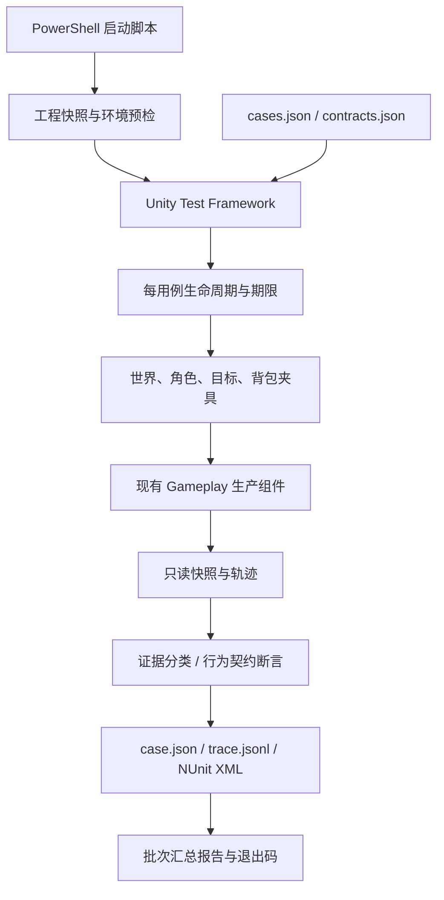

# Agent 目标选择、执行与交战：自动复现、修复与回归实施规划

- 日期：2026-09-11
- 状态：**用户已确认大架构并授权自主完成各阶段“小规划 → 实现 → 测试／Review → 调整 → 提交”闭环。P0 实施中。**
- 执行记录：[P0 自动运行](p0_execution.md)；[P1 指令／导航／提示](p1_execution.md)。
- 关联审查：[目标选择、执行与交战逻辑审查](../../outputs/agent_target_execution_combat_review.md)
- 修复设计：[生产文件职责、接口与修复方案](repair_design.md)。本文与修复设计共同构成当前方案。
- 调查基线：`810c99d1224f7166f325d3e985e27929f0fe26c6`。执行时另记录实际提交、工作区文件哈希和测试配置哈希。
- 范围变更：根据用户本次 Review，目标从仅构造复现工具扩展为实际修复 F1–F7、R1–R5 并自动验证；F3 改为允许有效受击打断。玩法方向已确认，不再列为待决；新增模块与接口依照项目约定先作架构 Review。

## 1. 问题、目标与验收标准

目前 F1–F7 和 R1–R5 缺少真实运行的连续证据。用户已明确修复范围和行为要求，包括撤离受击反击后恢复、资源任务可被伤害中断、不可达提示、双方跨高低差远程索敌，以及 R4／R5 必须修复。静态判断仍须用运行证据验证，但不能再把已确认规则标成“待人工决定”。

目标是由编码 Agent 执行完整工作链：

> 构造样例 → Agent 启动 Unity／Play Mode → 读取运行证据并定位 → 修改已评审的生产代码 → 重跑同一用例与对照 → 全量回归 → 交付修复与证据。

用户无需自己搭场景、点 Play、操作角色或收集日志。CLI 用于辅助 Agent 工作，不以“给用户一条命令让用户自己验证”作为交付；不另建自动修改源码的 CLI 系统。

### 1.1 范围

- 覆盖 F1–F7 的最小复现、必要对照组和真实组件集成验证。
- 修复 F1–F7、R1–R5，并为已确认规则增加失败断言；F5 与 R1 合并实施，R2 与 R3 合并实施。
- 新增正式游戏内顶部淡入／淡出的指令成功／失败提示，并验证失败原因。
- 实现 CLI 启动、编辑器版本识别、运行隔离、超时回收、机器可读结果及 Markdown 报告。
- 支持修复前诊断与修复后回归；使用同一套场景和证据，不复制两套用例逻辑。

非目标：不重写整个 Agent／Enemy 系统，不迁移业务程序集，不升级 Unity／Test Framework，不调整伤害平衡或重新设计敌人招式，不验证发布平台性能或完整游戏体验。允许修复设计列出的职责抽取、配置字段和正式提示预制体；正式关卡或既有 SO 如确需修改，先记录具体文件和原因。

### 1.2 验收标准

1. 在具备指定编辑器、有效 Unity 授权及完整资源的机器上，一条命令完成执行；无需人工点 Play、选场景、点击目标、拖装备或判断截图。
2. F1–F7 每组至少有一个自动触发样例与一个排除假阳性的对照；发现原判断不成立时如实报告未复现，不修改夹具强行制造结论。
3. 每个样例都有前提校验、独立 CaseId、截止时间、结果和证据；前提失败不得计为游戏 Bug 或通过。
4. 每个失败都能定位到“准备、触发、观察、断言、清理”中的具体步骤，并提供一条重跑命令。
5. 诊断结果与正确性结果分开；已知 Bug、没有运行的用例不得包装成通过。所有本次确认的规则必须参与严格回归。
6. 测试进程默认不改变源工程输入与正式存档；编码 Agent 在源工程实施计划内修复，每轮测试重新记录修改后的基线。异常退出也能保留已落盘证据。
7. 对关键场景进行重复运行验证稳定性；报告不只保留最后一次成功结果。
8. 交付包含真实修复和运行证据；不能只完成用例／脚本而将 Play Mode 操作或定位工作交给用户。

## 2. 已有能力与环境调查

| 项目 | 已核对事实 | 对方案的影响 |
| --- | --- | --- |
| Unity | ProjectVersion 为 `2022.3.62f2c1`；本机存在 `D:\UnityEditors\Unity 2022.3.62f2c1\Editor\Unity.exe`，文件产品版本与工程一致 | 可以自动选定匹配版本；不可误用本机其他 Unity 版本 |
| Test Framework | manifest 已安装 `com.unity.test-framework: 1.1.33` | 复用 NUnit／UnityTest／测试报告，不自建测试调度器 |
| 测试发现 | 该版本包内文档与 `EditorLoadedTestAssemblyProvider` 按 NUnit／TestRunner 引用识别测试程序集 | 可优先尝试现有 Editor 预定义程序集中的测试 |
| 当前程序集 | 业务无自有 `.asmdef`；生成的 `Assembly-CSharp-Editor.csproj` 已引用业务程序集、NUnit、Unity TestRunner 和 AI Navigation | 测试放在已有 Editor 目录体系，先做实际发现与编译验证；不手改生成的 csproj |
| Play Mode 驱动 | 包内 `EnterPlayMode`／`ExitPlayMode` 和 `UnitySetUp`／`UnityTearDown` 支持 Editor 测试自动进入运行态 | 全部入口可按 EditMode 发现，其中部分用例实际在 Play Mode 执行 |
| 显式时间 | `AgentBrainController.Tick`、`TryCastReadySkill` 接受时间参数；其他流程使用 Unity Time | 纯组件可控时间，集成场景走引擎时间，不能混用后声称确定性 |
| 生产接口 | `AgentTargetCommandDispatcher`、`TakeCombatDamage`、`EquipmentSlotUI.TryEquip`、`RaidFlowController.SetAgentInsideExtractionPoint` 已存在 | 可以直接程序触发，无需鼠标键盘自动化 |
| 隔离对象 | Registry、Inventory、Raid 等有静态实例；音频自动创建 DontDestroyOnLoad 对象 | 每用例恢复环境，每组进程隔离兜底 |
| 存档 | 仓库／经济路径直接来自 `Application.persistentDataPath` | 仅换目录复制工程不足以隔离存档，还必须隔离副本的公司／产品标识 |

读取依据包括：Agent 框架设计、敌人系统概览、现有审查、根目录历史 task_plan／progress，以及锁定版本的 Test Framework 源码与自带文档。历史 `.planning/.active_plan` 指向另一项任务，本规划不改写该指针。

**未验证事项**：本次没有启动 Unity 测试，没有验证本机许可证可用于批处理；Editor 预定义程序集中的新测试能否实际发现、跨 Play Mode 重载并输出结果，是阶段 P0 的首个验收门槛。

## 3. 推荐架构及依赖方向

### 3.1 采用现有 Unity Test Framework，Editor 承载运行态测试

新增代码放入 `Assets/Scripts/Editor/AgentReproduction/`，归入现有 `Assembly-CSharp-Editor`。普通 `[Test]` 承担纯组件校验；需要导航／物理／MonoBehaviour 生命周期的 `[UnityTest]` 自动进入 Play Mode。

该版本的协程参数化使用 `ValueSource`，不对 `[UnityTest]` 使用不受支持的 `TestCase`。参数展开后的每个 CaseId 都进入运行清单，并核对实际发现数量，避免一组只运行首个敌人类型却被统计为全覆盖。

命令行入口仍是 `-testPlatform EditMode`，因为这是测试程序集的发现分类；报告另记录每个 Case 的实际执行环境 `Component` 或 `PlayMode`。不把进入过 Play Mode 的 Editor 测试误称为独立 Player 构建测试。

阶段 P0 若证明该接入方式不可用，应停止后续用例实现并提交程序集替代方案。不得静默给整个业务目录添加 `.asmdef`，也不得通过修改生成的 csproj 绕过 Unity 编译体系。



依赖约束：

- 测试代码可以依赖 Gameplay；Gameplay 不引用测试代码、NUnit 或报告类型。
- 场景工厂负责生成对象，不决定测试通过与否；断言负责判定，不写被测状态。
- 观察器只读运行时对象；配置写入集中在夹具接入层，限测试对象／配置副本。
- PowerShell 负责环境、进程和结果完整性；游戏行为由 Unity Test Framework 和真实生产组件执行。
- 用例调用生产指令、伤害、换装和撤离接口，不在测试中复制目标选择、状态转移或技能冷却算法。

### 3.2 Reuse / Extend / Wrap / Create：具体文件

以下均为工程相对路径。生产修复的**完整逐文件清单**见 [修复设计第 3 节](repair_design.md#3-分层目录与依赖)，测试新增文件逐一列于本文第 8.1 节，不能用“复用运行时”“扩展能力”等概念替代文件归属。

| 选择 | 具体文件 | 职责处理 |
| --- | --- | --- |
| Reuse | `Packages/manifest.json`、`Packages/packages-lock.json` | 沿用已锁定的 Test Framework／Navigation，不升级依赖 |
| Reuse | `Assets/Scripts/Gameplay/Agent/Runtime/AgentRuntimeRegistry.cs`、`Assets/Scripts/Gameplay/Agent/Runtime/AgentRuntimeQuery.cs` | 注册、存活和多 Agent 候选查询 |
| Reuse | `Assets/Scripts/Gameplay/Targets/Authoring/ResourceClusterAuthoring.cs` | 实际成员与可达停靠点，不复制导航候选算法 |
| Reuse | `Assets/Scripts/Gameplay/Backpack/EquipmentSlotUI.cs`、`Assets/Scripts/Gameplay/Raid/RaidFlowController.cs` | 用实际换装／撤离链触发集成样例 |
| Extend | `Assets/Scripts/Gameplay/Agent/Core/AgentPawnRoot.cs`、`Assets/Scripts/Gameplay/Agent/Interfaces/IAgentCommandReceiver.cs` | 组合和转发指令生命周期，新增结构化结果与终态接口 |
| Extend | `Assets/Scripts/Gameplay/Targets/Input/AgentTargetCommandDispatcher.cs` | 接受前验证、结果反馈、移除先写事实的提交顺序 |
| Extend | `Assets/Scripts/Gameplay/Agent/Runtime/AgentTargetDiscoveryController.cs`、`Assets/Scripts/Gameplay/Agent/Decision/AgentTargetDecisionController.cs` | 接入同一具体成员候选和已确认感知约束 |
| Wrap | `Assets/Scripts/Gameplay/Enemy/EnemyVisionUtility.cs` | 保留调用入口，委托共用空间查询 |
| Wrap | `Assets/Scripts/Editor/AgentReproduction/Infrastructure/RuntimeFixtureAccess.cs`（新建包装层） | 集中包裹测试配置注入和私有只读观察，禁止任意修改被测结果 |
| Create | `Assets/Scripts/Gameplay/Agent/Commands/AgentDirectiveLifecycleController.cs` | 当前任务、撤离挂起恢复及终态唯一编排 |
| Create | `Assets/Scripts/Gameplay/Agent/Navigation/AgentNavigationQuery.cs`、`Assets/Scripts/Gameplay/Agent/Navigation/AgentNavigationMotor.cs` | 分离无副作用的路径／到达查询与有状态移动执行 |
| Create | `Assets/Scripts/Gameplay/Agent/Targeting/AgentTargetCandidateCollector.cs` | 为新选／保持／评分提供同一成员事实 |
| Create | `Assets/Scripts/Gameplay/Perception/TargetVisibilityQuery.cs`、`Assets/Scripts/Gameplay/Enemy/EnemyTargetSelector.cs` | 分别负责空间约束和敌人候选策略 |
| Create | `Assets/Scripts/Gameplay/Targets/Presentation/AgentCommandFeedbackPresenter.cs`、`Assets/Resources/HUD/Pfb_AgentCommandFeedback.prefab` | 正式游戏顶部指令反馈 |
| Create | `Assets/Scripts/Editor/AgentReproduction/Infrastructure/ReproductionTestFixture.cs`、`Assets/Scripts/Editor/AgentReproduction/Reporting/CaseArtifactWriter.cs` | 用例生命周期与证据落盘；其他新增测试文件见 8.1 |
| Create | `tools/agent-repro/Invoke-AgentRepro.ps1`、`tools/agent-repro/AgentRepro.Workspace.psm1`、`tools/agent-repro/AgentRepro.Report.psm1` | 自动启动、隔离、超时处理和报告汇总 |
| Extend | `outputs/agent_target_execution_combat_review.md`、`.planning/2026-09-11-agent-reproduction/task_plan.md` | 记录实际复现、修复与验证结果 |
| Create | `.planning/2026-09-11-agent-reproduction/repair_design.md` | 本次新增：承载生产代码文件清单、依赖和修复接口；与测试基础设施细节分开 |

生产接口变化服务于指令生命周期和正式游戏反馈，不为测试便利任意暴露内部状态。超出已评审边界的重大变化才需要重新讨论；正常定位、修复迭代和运行测试由 Agent 持续完成。

### 3.3 使用的组织模式

- **Fixture + Factory**：生命周期、对象创建和测试意图分离。
- **Adapter**：集中处理私有配置／观察字段，限制反射范围；不建立通用任意反射框架。
- **数据驱动测试**：复用敌人类型、布局、距离、时间窗口与随机种子的变体。
- **独立结果判定**：分别记录执行成功、症状是否复现和行为契约是否满足。
- **资源作用域**：每个用例登记并释放自身对象、SO 副本、导航数据和全局设置。

## 4. 自动运行与隔离

### 4.1 启动流程

1. 解析 `ProjectVersion.txt`，按显式 `-UnityPath`、已安装编辑器目录等顺序寻找完全匹配版本，读取文件版本验证。
2. 记录提交、dirty 状态、用例配置哈希；对待复制资源检查 Git LFS 指针缺失。环境不满足时输出 `ENVIRONMENT_ERROR`，不弹窗、不等待人工选择。
3. 将当前工作区的 `Assets`、`Packages`、`ProjectSettings` 和测试配置复制到 `%TEMP%/AnomalySearch-AgentRepro/<run-id>/Project`；包括尚未提交的实现文件，排除 Library／Temp／Logs／构建产物。记录逐文件清单，复制前后确认源输入没有发生变化。
4. **只在副本中**设置专用 companyName／productName，例如 `AnomalySearch.Automation`／`AgentRepro_<run-id>`。随后检查运行时实际 persistentDataPath 与源产品路径不同，且归属于本次运行。测试不备份覆盖正式存档，也不对正式 PlayerPrefs 执行 DeleteAll。
5. 启动预检与 Smoke；校验新测试确实被发现，进入／退出 Play Mode、NavMesh 与碰撞最小用例能运行，结果文件能写出。
6. 按 Case Group 串行启动 Unity 测试进程；独立组之间可在上组崩溃后继续。默认不并行运行多个占用导航、静态状态和资源的测试进程。
7. 为每组设置进程级墙钟期限；超时只回收启动器创建并记录身份的进程树。不得关闭其他项目的 Unity。
8. 汇总所有预定 Case 的完成情况、NUnit XML 与证据文件；即使 Unity 未产出完整 XML，也为缺失用例生成未执行／中断记录。
9. 校验源工程未被改变。默认保留失败工程副本与证据；成功副本可自动清理。任何递归清理都要验证绝对路径在本次 run-id 根内，且所有权标记匹配。

不依赖当前编辑器是否打开，不抢占当前场景。初次导入耗时单独记录，不计入行为观察窗口。复制快照的磁盘与导入成本是本方案用来换取隔离的明确代价。

### 4.2 每用例生命周期

1. 从磁盘运行清单恢复 CaseId／输出路径，创建空场景；启用正常 Domain Reload／Scene Reload。
2. 自动进入 Play Mode，随后重新读取上下文；不依赖跨重载的静态变量、非持久 SO 或旧 C# 对象引用。
3. 创建 inactive staging root，在激活前配置唯一 AgentId、SO 副本、敌人配置、群成员及碰撞体；激活后等待真实 Awake／OnEnable／Start 完成。
4. 校验注册数量、生命、目标身份、真实空间关系、资源非空、导航连通性等。任何一项不符合预期都停止该用例并报告准备错误。
5. 执行刺激事件；使用公共生产接口。需要只读访问私有缓存时通过集中 Adapter，禁止直接写“目标已切换”“搜索已到达”等结果字段。
6. 采样状态，达到证据条件或期限后输出 `case.json` 和 `trace.jsonl`，再执行 NUnit 断言，确保断言失败仍有证据。
7. `UnityTearDown` 恢复 timeScale／fixedDeltaTime／随机状态，移除创建的 NavMeshData、对象和配置副本，退出 Play Mode。清理失败单独记录，不掩盖原始失败。

无法完成 teardown 的硬崩溃由外部启动器接管；下一组使用新的 Unity 进程。普通断言失败依靠 Test Framework 继续执行同组其他用例。

### 4.3 时间与稳定性

- 集成样例使用真实 Unity Update／FixedUpdate、`timeScale=1` 和明确的 fixedDeltaTime；不手动 Tick 仍处于 enabled 状态的同一生产组件。
- 纯技能组件验证可以使用显式 t0／t1／t2；先确认该样例不混入依赖 Time.time 的效果或其他自动施法路径。
- 用例期限同时包含引擎时间和独立墙钟；即使游戏误暂停也会终止。避免只用 WaitForSeconds 等待。
- 导航构建、注册、绑定和首次攻击用“条件满足或超时”同步，不用未经校验的固定等待替代准备完成。
- 不依赖某两个 MonoBehaviour 的默认 Update 顺序；对稳定后的状态或连续采样序列断言。关键刺激前后立即记录一对快照。
- 默认固定随机种子；`-Repeat 3` 以同一输入重复三次，检查可重复性。额外种子矩阵另列参数，避免把不同输入混称为同一用例的重复运行。保留每次结果，失败后重试成功也记为不稳定，不覆盖原失败。
- 不使用批处理不可靠的截图等待作为行为验收；`-nographics` 默认仅验证逻辑。VFX 依赖导致运行问题时报告环境／夹具问题，不能静默跳过核心逻辑。

拟定默认硬期限：初次导入／编译 45 分钟、每组测试进程 15 分钟、单 Case 墙钟 120 秒。行为窗口另按配置计算，F5 默认观察 10 秒游戏时间；首次导入、准备和清理不占行为窗口。所有预算写入运行清单并允许显式覆盖；墙钟期限始终生效，不能通过反复续期形成无限等待。这些是保护预算，不是预计执行耗时。

## 5. 结果语义与已确认行为契约

每个 Case 同时输出三组结果：

| 维度 | 值 | 含义 |
| --- | --- | --- |
| execution | COMPLETED / SETUP_FAILED / TIMED_OUT / CRASHED / CLEANUP_FAILED / NOT_RUN | 样例是否有效执行完毕；未开始的预定用例也必须有记录 |
| observation | REPRODUCED / NOT_REPRODUCED / INCONCLUSIVE | 是否观察到定义的症状；NOT_REPRODUCED 只针对本样例和窗口 |
| contract | PASS / FAIL / UNSPECIFIED | 是否满足已选行为契约；本次用户已确认的规则不得用 UNSPECIFIED 跳过 |

运行模式：

- **Diagnose**：以收集完整证据为目标。已知 Bug 可以被复现，但报告清晰显示 REPRODUCED／FAIL；不会反过来断言“出现 Bug 就是功能通过”。
- **Regression**：对已确认的行为契约断言。业务失败、不稳定、预期 Case 缺失、核心用例前提不成立都使整批失败；核心契约未配置时报告契约未决。

NUnit XML 保留真实断言失败，不使用 Ignore／ExpectedFailure 把已知 Bug 隐藏。外层报告分别给出“执行是否完成”和“业务是否通过”。

建议 CLI 退出码：`0` 表示当前模式的执行条件满足；`1` 为 Regression 行为失败／不稳定；`2` 为环境、夹具、崩溃、数据缺失或执行完整性错误；`3` 为 Regression 必需契约尚未确定。Diagnose 的 0 只代表有效诊断完成，报告必须同时显示发现多少问题，不能解释为无 Bug。

### 5.1 按用户 Review 固定契约

| 编号 | 回归必须检查的结果 |
| --- | --- |
| F1 | 撤离受击切入反击，结束后恢复原撤离任务；重复受击、新手动命令和死亡的恢复／取消正确 |
| F2 | 无效目标整体解绑并选择新有效目标；伤害与位移接收器不能残留旧身份 |
| F3 | 手动资源任务能被有效伤害中断；仅有敌人可见而未受击时不抢走手动资源任务 |
| F4 | 固定几何与完成状态下，新选和保持采用同一口径，不振荡 |
| F5 + R1 | 可执行性预检、正确容差、执行失败后释放锁；顶部成功／具体失败原因提示 |
| F6 | 扫描所有有效候选，能发现满足感知的 B；不要求正在交战时无理由换近目标 |
| F7 | 属性变化不清空冷却，普通攻击也不因状态重入提前 |
| R2 + R3 | 范围、射线和墙体有效；双方远程三维索敌／瞄准；无墙高差能命中，有墙不能被直伤兜底或弹体穿透 |
| R4 | 实际防御、完整去重风险集合、具体成员距离、远处合法撤离兜底 |
| R5 | 外部位移后重新验证距离并靠近，不在远处继续搜刮 |

`contracts.json` 将这些产品规则标记为 Confirmed，记录用户本次 Review 为依据。精确数值参数和新增文件边界属于当前推荐实现方案，见修复设计；不得把它们误写为用户指定数值。UNSPECIFIED 仅留给后续另行发现的范围外问题。执行与定位过程中不向用户索要手工 Play Mode 操作。

## 6. F1–F7 的具体构造方案

### F1：撤离受击状态冲突

- **布局**：一个有效 Agent、未到达的撤离目标、高血量敌人；关闭该 Agent 的自主发现但保留 Brain 与真实受击路径，避免外部扫描覆盖证据。另做自主发现启用的集成变体。
- **前提**：通过 `AgentTargetCommandDispatcher.TrySubmitClusterCommand` 提交 Extract，确认 Pending=Extract、ShouldExtract=true、当前状态进入 Extraction；敌人存活，角色无足以吸收全部伤害的护盾。
- **刺激**：调用 `AgentPawnRoot.TakeCombatDamage(..., enemy.gameObject)`。不得使用没有敌人 source 的 ApplyDamage 代替，后者不走本问题的反击入口。
- **证据**：立即记录伤害返回值和三个状态值，再采集至少 20 次 Brain 状态变化机会。记录是否出现持续的 Extraction／Combat 交替、指令不匹配、反击锁保持。
- **断言**：受击实际扣血并进入 Combat，保存原撤离请求且活动 ShouldExtract 不与反击冲突；击杀／销毁反击目标后自动恢复原撤离目标与 CommandId。不得出现稳定 ABAB 循环；容许一次正常状态转移帧。
- **变体**：敌人在射程外用于观察状态振荡；射程内、技能禁用的配置副本用于观察普通攻击节奏。攻击节奏以真实弹体生成／伤害事件为依据，不通过攻击动画计数。
- **对照**：相同撤离场景不受击；普通 Engage 场景下相同伤害不引入 ShouldExtract。
- **边界**：连续两次受击仍只挂起一份撤离任务；反击中下达新手动命令后不恢复旧撤离；死亡取消恢复；恢复时原撤离点失效产生明确失败。攻击节奏跨反击／撤离状态切换也不提前。

### F2：死亡／销毁后的目标重绑定

- **参数**：Ranged、Anchor Sentinel、Hunter Boss 三类正式敌人；使用各自真实行为脚本与配置副本。
- **布局**：A 初始更近，B 在合法发现／攻击位置；Agent 自主战斗关闭，敌人逻辑正常。通过初始距离让敌人自然绑定 A，准备断言必须确认绑定成功。
- **死亡刺激**：通过真实伤害令 A 死亡，保留尸体 Transform；B 存活。无 RaidFlow 的死亡子用例隔离全局输赢干扰。
- **销毁刺激**：先用单独的目标销毁子用例定位缓存；再用带 RaidFlow 的实际撤离子用例确认真实交接。实际撤离通过公开 presence 接口驱动计时，等待生产流程销毁 A；报告明确这是流程接口集成，不代表验证了鼠标或触发器碰撞。B 留场，避免全员撤离导致暂停。
- **判定**：目标引用在观察窗口内改为 B；读取伤害接收器根与 B 一致；等待配置允许的一次实际攻击后检查 B 生命变化。不同敌人的窗口按锁定／冷却／攻击周期计算，设置上限。
- **对照**：只有 B 时敌人能发现并伤害它；基础近战作为已有死亡重选路径的对照。若独立 B 也无法被命中，主用例归为夹具无效，不归为 F2。

### F3：手动资源指令允许有效受击打断

- **布局**：非空、未完成、可达的资源群；Agent 到达前的 Search 阶段作为首个样例，另测到达后等待交互阶段。
- **触发**：走真实手动派发器，保存 CommandId、Priority、TargetId；有效敌人伤害之后读取同样字段。
- **观察**：由 ManualTargetClick 转入 CombatDamageInterrupt，确认进入反击、旧资源锁释放、指令与事实同步。
- **契约**：允许有效受击打断，不再将覆盖本身视为 Bug；清理过时保护规则和注释。仅 F1 明确要求恢复原任务，F3 反击结束后回到正常自主选择。
- **对照**：没有伤害仅出现可见敌人时，手动资源指令保持；完全吸收的伤害和无效伤害来源不误触发反击；自动资源任务同样允许受击打断。

### F4：距离口径造成目标循环

- **几何**：Agent 在 x=0；同一个资源群的成员在 x=2 和 x=38，实际计算群中心约 x=20；敌人在 x=12。地面连通，发现半径覆盖全部成员。
- **隔离**：使用 moveSpeed=0 的配置副本固定位置；禁止敌人攻击和移动；资源保持非空未完成；启用真实默认发现模块，禁用评分模块。
- **避免修复互相干扰**：该用例将扫描间隔设为 0.1 秒，在导航无进展期限之前完成六次扫描；记录配置覆盖。不能因主动固定位置触发 F5 后，把任务失败误判为 F4 已稳定。
- **前提**：断言实际最近资源／敌人／群中心距离满足严格排序，不把预期中心直接写进缓存。
- **观察**：等待至少六次已确认的扫描机会，采集 Search／Engage 和目标 ID 序列；不存在手动或反击锁。
- **判定**：固定输入下的两态循环是复现证据；正常契约要求选择稳定。对照将群中心移到同侧近处，或移除敌人，结果应稳定。
- **调度记录**：必要时只读扫描调度字段确认扫描确实发生；不通过反射直接调用私有选择方法绕过生产调度。

### F5 + R1：不可达、到达容差与指令反馈

- **几何**：程序构建两个不相连的 NavMesh 岛，间距大于目标采样半径、攻击距离和交互距离；没有 OffMeshLink。
- **前提**：Agent 正确位于 NavMesh；目标可采样；跨岛路径不是 Complete；另一侧未完成目标身份有效。另有本侧可达目标作为恢复观察对象。
- **触发**：通过手动派发器分别选远侧资源、射程外敌人、撤离点；动态阻断作为附加样例，阻断后重新校验路径确实不可达。
- **证据**：接受结果、原因码、位移、路径状态、Directive／锁、顶部提示文字和 alpha 轨迹。若程序走直线穿过去，记录为导航退化异常，不计成功恢复。
- **契约**：初始不可达则拒绝并保留先前有效命令，不能先弹成功再立即失败；接受后动态失败则在配置期限内释放当前任务／锁，输出一次带原因的失败。前提准备完成后用 10 秒上限观察建议 3 秒无进展恢复，不将 10 秒当游戏放弃阈值。
- **对照**：连通平面能接受并到达；零交互距离在容差内完成；解除阻断后新命令能执行；隔岛但在射程内且无遮挡的远程敌人命令可接受，不能误要求步行到目标脚下。
- **UI**：成功、初始拒绝、动态失败、快速连续下令、重复终态、timeScale=0 均自动验证；图形运行由 Agent 自动截取顶部淡入／显示／淡出证据。业务逻辑测试与真实 UI 渲染分别出结果。

### F6：巡逻感知遗漏 B

- **布局**：A 起初更近，但位于敌人背后且不满足视角条件，B 初始在发现范围外，使敌人在 Patrol 中自然缓存 A。确认没有进入追击后，将仍存活的 A 移到发现范围外，让 B 从敌人正前方进入视野。敌人巡逻配置副本固定移动／等待方向，无外部怀疑刺激。
- **前提**：敌人仍在 Patrol，缓存 A；B 存活；用实际 EnemyVisionUtility 验证 B 满足角度、距离、遮挡条件。
- **观察**：自然推进感知逻辑，记录当前目标和是否进入发现／追击。禁止 B 主动攻击，以免直接受击回调替代巡逻发现。
- **对照**：移除 A 后，同样的 B 能被发现；B 在视角外时不应误发现。对基础近战、Ranged、Modern、Tidal、Ancient 分别参数化运行。
- **边界**：不要求正在 Combat 的敌人立即切换到最近 Agent；本组只检查 Patrol 重新发现。

### F7：换装重建技能冷却

- **组件样例**：使用实际技能配置副本与 AgentCombatController，将风格副本限制为一个真实技能，排除“另一技能本来已经就绪”造成的假阳性。固定目标在合法施放位置并提高生命。
- **刺激**：t0 成功施放；在 t0+短间隔调用 ApplyConfig，仅改变 TotemModifierSet 中的伤害／防御等修正，保持技能身份与冷却配置不变。再通过真实 TryCastReadySkill 观察能否提前施放。
- **断言**：原冷却截止之前不能再次成功施放，截止之后能施放。若第一次没有施放成功或第二次目标无效，则样例无效。
- **集成样例**：实例化实际背包 UI／装备槽，程序构建物品并调用 `EquipmentSlotUI.TryEquip`／ReleaseEquippedItem，经过实际 Inventory 修正构建及 Pawn 定期刷新；不模拟鼠标拖拽，也不直接写最终图腾修正或技能冷却字段。
- **对照**：不换装；应用完全相同的修正；更换有差异修正。选择与当前技能冷却足够分离的刷新窗口，记录实际属性已生效的证据。

## 7. R1–R5 已确认修复项的样例

| 风险 | 参数矩阵与观察 | 判定边界 |
| --- | --- | --- |
| R1 | 与 F5 合并：InteractionDistance 取 0／0.05／0.2，平面／坡面、多个终点偏移及上下层；记录实际距离、采样点和剩余距离 | 可达且在容差内应完成；禁止跨楼板交互；不可达明确失败并反馈，不能永远 Running |
| R2 + R3 | 无墙／厚墙／薄墙／楼板；高度差 0／正／负；发现前、发射前、飞行中插入墙；主角普攻／远程技能、Ranged／Sentinel／Boss 定向远程分别运行 | 合法三维射程内无遮挡必须能发现并命中；遮挡后不选为新可见目标、不穿墙发射／命中；超范围拒绝；枪口受阻不能直伤兜底 |
| R4 | 实际防御变化、同群多敌人及重复成员引用、成员／群中心分离、范围外撤离点；单独启用 Decision | 防御与 Pawn 一致；风险敌人逐实体计数；距离来自实际成员；无其他任务能选合法远处撤离 |
| R5 | 到达等待资源后施加独立位移，保持同一任务／成员；另测完全吸收伤害但仍发生位移的组合 | 必须撤销到达缓存、停止远距交互并重新靠近；资源完成状态不得伪造 |

每组至少有前提与对照，并进入严格回归。F2／F6 的目标选择样例同时覆盖遮挡的 A 与可见的 B；不能只验证空间工具而遗漏控制器调用。

## 8. 建议目录结构与文件职责

以下为测试／运行工具的拟新增文件；生产修改、新目录和提示资产详见 [修复设计第 3 节](repair_design.md#3-分层目录与依赖)。本次实际改动仅规划与审查文档。暂不迁移业务程序集、不升级 Packages；测试副本的存档身份修改不回写正式 ProjectSettings。

```text
Assets/Scripts/Editor/AgentReproduction/
├─ Model/
│  ├─ ReproductionCase.cs
│  └─ ReproductionResult.cs
├─ Infrastructure/
│  ├─ TestRunContext.cs
│  ├─ ReproductionTestFixture.cs
│  ├─ RuntimeFixtureAccess.cs
│  └─ RuntimeWait.cs
├─ World/
│  ├─ TestWorldBuilder.cs
│  ├─ TestNavMeshBuilder.cs
│  ├─ AgentFactory.cs
│  ├─ EnemyFactory.cs
│  ├─ TargetFactory.cs
│  ├─ InventoryFixture.cs
│  └─ RaidFixture.cs
├─ Observation/
│  ├─ RuntimeSnapshot.cs
│  └─ RuntimeTraceRecorder.cs
├─ Assertions/
│  ├─ ReproductionAssertions.cs
│  └─ ReproductionEvidenceClassifier.cs
├─ Reporting/
│  └─ CaseArtifactWriter.cs
└─ Tests/
   ├─ HarnessSmokeTests.cs
   ├─ CommandLifecycleTests.cs
   ├─ CommandFeedbackTests.cs
   ├─ PerceptionContractTests.cs
   ├─ F1ExtractionInterruptTests.cs
   ├─ F2EnemyRetargetTests.cs
   ├─ F3ManualResourceTests.cs
   ├─ F4DiscoveryStabilityTests.cs
   ├─ F5UnreachableDirectiveTests.cs
   ├─ F6PatrolPerceptionTests.cs
   ├─ F7TotemCooldownTests.cs
   ├─ NavigationInteractionRiskTests.cs
   ├─ CombatGeometryRiskTests.cs
   └─ DecisionInputRiskTests.cs
tools/agent-repro/
├─ Invoke-AgentRepro.ps1
├─ AgentRepro.Workspace.psm1
├─ AgentRepro.Report.psm1
├─ cases.json
├─ contracts.json
└─ README.md
.planning/2026-09-11-agent-reproduction/
├─ task_plan.md
├─ repair_design.md
└─ architecture_review.md       # 完成实现后生成
Logs/AgentReproduction/<run-id>/ # 运行产物，已被现有 gitignore 排除
```

### 8.1 每个文件独立存在的理由

| 文件 | 职责／独立理由 |
| --- | --- |
| Model/ReproductionCase.cs | Case、参数、预算、契约引用的 DTO；与具体场景及 NUnit 生命周期解耦 |
| Model/ReproductionResult.cs | 三维结果、时间、证据索引、异常信息；统一报告格式 |
| Infrastructure/TestRunContext.cs | 读取运行清单与输出位置，跨 Domain Reload 恢复上下文；不创建场景 |
| Infrastructure/ReproductionTestFixture.cs | UnitySetUp／UnityTearDown、对象所有权与环境恢复；不放具体 Bug 步骤 |
| Infrastructure/RuntimeFixtureAccess.cs | 序列化配置注入和必要私有字段只读访问；集中名称／类型校验，禁止零散反射 |
| Infrastructure/RuntimeWait.cs | 条件等待、帧数与墙钟／游戏时间截止；不承担行为判定 |
| World/TestWorldBuilder.cs | 空场景、地面、墙、staging root、对象清单；不负责导航算法 |
| World/TestNavMeshBuilder.cs | 构建／移除本用例导航数据、验证初始连通性；隔离 NavMesh 生命周期 |
| World/AgentFactory.cs | Agent 预制体、配置副本、唯一 ID 与组件激活顺序 |
| World/EnemyFactory.cs | 正式敌人类型、配置副本和感知／攻击对照准备；统一类型差异 |
| World/TargetFactory.cs | 真实资源／敌人／撤离群及成员装配；保证非空和有效身份 |
| World/InventoryFixture.cs | 实际 Inventory／装备槽／物品的程序装配与公共操作，隔离 UI 依赖复杂度 |
| World/RaidFixture.cs | 真实撤离流程准备、presence 驱动、结算完成观察；不复制结算算法 |
| Observation/RuntimeSnapshot.cs | Agent、Enemy、导航、生命与指令的只读采样结构 |
| Observation/RuntimeTraceRecorder.cs | 采样节奏、事件时间线与逐步落盘；不决定测试结果 |
| Assertions/ReproductionAssertions.cs | 已确认契约和共用不变量；失败信息必须包含证据索引 |
| Assertions/ReproductionEvidenceClassifier.cs | 从轨迹识别振荡、覆盖、无进展、过早施法等症状；与 PASS／FAIL 分开 |
| Reporting/CaseArtifactWriter.cs | 写单用例 JSON、轨迹与元数据，断言前及清理后均可更新；不汇总整个批次 |
| Tests/HarnessSmokeTests.cs | 发现／重载／配置激活／存档隔离／导航／碰撞／落盘的基础验收 |
| Tests/CommandLifecycleTests.cs | 挂起／恢复、取消、重复受击、旧 CommandId 延迟回调不覆盖新命令 |
| Tests/CommandFeedbackTests.cs | 指令结果、原因文字、顶部位置、去重、淡入淡出与暂停下动画 |
| Tests/PerceptionContractTests.cs | 三维距离、水平视角、射线遮挡、自身／目标／Trigger 过滤和高度边界 |
| Tests/F1ExtractionInterruptTests.cs | F1 场景、刺激、窗口和对照 |
| Tests/F2EnemyRetargetTests.cs | F2 敌人参数化、死亡与实际撤离变体 |
| Tests/F3ManualResourceTests.cs | F3 允许有效伤害中断、仅可见不打断及旧锁释放 |
| Tests/F4DiscoveryStabilityTests.cs | F4 固定空间布局和连续扫描稳定性 |
| Tests/F5UnreachableDirectiveTests.cs | F5 静态不连通、动态阻断、解除阻断对照 |
| Tests/F6PatrolPerceptionTests.cs | F6 多 Agent 视野候选与单目标对照 |
| Tests/F7TotemCooldownTests.cs | F7 属性刷新、装备链和冷却时间验证 |
| Tests/NavigationInteractionRiskTests.cs | R1／R5，复用导航与交互夹具，分别独立 Case |
| Tests/CombatGeometryRiskTests.cs | R2／R3，复用墙体、弹道和碰撞证据 |
| Tests/DecisionInputRiskTests.cs | R4 候选、风险与实际属性输入 |
| tools/agent-repro/Invoke-AgentRepro.ps1 | 参数解析、串行调度、进程期限、完整性判定和退出码 |
| tools/agent-repro/AgentRepro.Workspace.psm1 | 版本定位、源快照、LFS 检查、存档隔离、路径所有权与清理 |
| tools/agent-repro/AgentRepro.Report.psm1 | 合并 XML／case JSON、识别缺失用例、汇总重复运行并生成 Markdown |
| tools/agent-repro/cases.json | CaseId、参数、类别、种子、期限、依赖与预期数量；不包含测试算法 |
| tools/agent-repro/contracts.json | 本次已确认行为契约与用户 Review 依据；建议数值参数另标来源 |
| tools/agent-repro/README.md | 一条命令用法、结果字段、环境错误与重跑方式 |
| 本 task_plan.md | 架构、范围和各阶段实施结果的权威记录 |
| repair_design.md | 生产修复具体文件、接口、依赖和行为方案 |
| architecture_review.md | 实现完成后的边界、依赖、可重复性及资源清理审查记录 |

新增 Unity 文件配套 `.meta` 由匹配版本编辑器生成并随实现保留；不创建源工程内的永久测试关卡。正式指令提示预制体属于产品资产，需要落到源工程。暂不新增 `.asmdef`。`outputs/agent_target_execution_combat_review.md` 已增加规则变更说明，获得运行证据后再更新修复结论与报告链接。

## 9. 关键接口、数据流与输出

接口意图如下，具体签名在实现阶段按相同职责收敛：

| 接口 | 输入 → 输出 | 约束 |
| --- | --- | --- |
| TestRunContext.Load | run manifest + CaseId → 配置、契约、输出目录 | 重载后可恢复，读取失败即环境错误 |
| AgentFactory.Create / EnemyFactory.Create | 预制体／配置副本 + 布局 → 真实组件句柄 | 不返回替代 AI 实现 |
| TargetFactory.CreateResourceCluster | 成员定义 → 真实群与非空资源 | 不伪造完成状态或缓存中心 |
| RuntimeFixtureAccess.Configure | 测试对象 + 已知字段 → 校验过的实例配置 | 不修改项目资产；找不到字段不吞异常 |
| RuntimeWait.Until | 条件 + 游戏时间／墙钟预算 → 条件满足或有证据的期限错误 | 不无限等待 |
| RuntimeSnapshot.Capture | 当前实际对象 → 不可变采样 DTO | 不影响选目标、状态或导航 |
| ReproductionEvidenceClassifier.Evaluate | Case 规则 + 轨迹 → 症状结果与证据区间 | 不以“预期有 Bug”为通过标准 |
| CaseArtifactWriter.Write | 结果 + 轨迹索引 → 原子更新的 case.json | 出错前保留已有轨迹；不覆盖其他 Case |

每次运行至少输出：

```text
Logs/AgentReproduction/<run-id>/
├─ manifest.json         # 源提交、dirty 文件清单、哈希、Unity/包版本、种子、运行模式
├─ summary.json          # execution / observation / contract 分项统计、覆盖率
├─ report.md             # 按 F/R 编号汇总，链接原始证据与重跑命令
├─ groups/<group-id>/
│  ├─ Editor.log
│  └─ test-results.xml   # NUnit 原始结果，不伪造“全绿”
└─ cases/<case-id>/<repeat>/
   ├─ case.json          # 前提、刺激、契约状态、实际结果、异常与清理情况
   └─ trace.jsonl        # frame/time、指令、事实、锁、宏状态、导航、目标引用、HP
```

报告必须区分：已执行／计划总数、已确认契约通过率、复现数量、未定规则、前提失败、超时与不稳定数量。禁止只展示“已执行且成功的子集”。

## 10. 拟定命令与无人值守体验

以下是**拟实现接口**，当前脚本尚不存在；实现后由编码 Agent 主动运行，不要求用户自行执行：

```powershell
# 默认：匹配编辑器、隔离工作区、诊断全部 F1–F7
./tools/agent-repro/Invoke-AgentRepro.ps1 -Mode Diagnose -Suite Core

# 自动运行风险观察组
./tools/agent-repro/Invoke-AgentRepro.ps1 -Mode Diagnose -Suite Risks

# 重复性验证
./tools/agent-repro/Invoke-AgentRepro.ps1 -Mode Diagnose -Suite Core -Repeat 3

# 针对单组重跑
./tools/agent-repro/Invoke-AgentRepro.ps1 -Mode Diagnose -Group F2

# 已确认契约的修复后回归
./tools/agent-repro/Invoke-AgentRepro.ps1 -Mode Regression -Suite Core

# 全部修复项，包含 R1–R5 以及真实图形模式提示检查
./tools/agent-repro/Invoke-AgentRepro.ps1 -Mode Regression -Suite All -IncludeGraphics
```

内部调用 Unity 采用参数数组，包含 `-batchmode -nographics -runTests -testPlatform EditMode -testFilter ... -testResults ... -logFile ...`。不使用 `-runSynchronously`，它会过滤需要多帧的 UnityTest；不附加会让异步测试提前退出的 `-quit`。测试结束由 Test Framework 正常收尾，进程期限由外部脚本兜底。

Windows 后台启动使用隐藏窗口。自定义配置通过启动器生成的运行清单传入，避免长命令行拼接或把测试逻辑塞进 shell 字符串。

`-IncludeGraphics` 单独启动去掉 `-nographics` 的 UI 组，自动保存淡入／显示／淡出截图并记录图形环境。Agent 读取图片完成视觉检查；逻辑组继续使用无图形模式。图形组失败必须由 Agent 查日志、检查环境或修正 UI 后重跑，不能让用户手动验证后补一个“通过”。

不得用后一次成功覆盖前一次失败；不得把环境失败当作“需要人点一下”的隐式步骤。报告应直接说明需要修复的环境条件和已完成的其他用例。

## 11. 实施阶段、验收与结果记录

### P0：验证最小接入、运行隔离和取证闭环

- 交付：CLI 基础、快照／存档隔离、最小 Fixture、Smoke、单用例结果格式。先让一个真实失败样例可运行，不以完整通用测试平台作为业务修复前置。
- 验收：新测试可被发现；自动进入／退出 Play Mode；空测试、真实 NavMesh 和碰撞对照能执行；故意失败仍有 XML／JSON；超时能由启动器回收并继续另一组；源文件和存档不变。
- 架构门槛：若必须调整业务程序集或增加修复设计清单之外的生产接口，先更新方案并确认；已列入本方案的结果／终态接口不重复申请确认。
- **实施结果：已完成。** 现有 Editor 程序集成功发现测试并自动进入 Play Mode；导航／物理／存档隔离 1/1 通过，故意失败与超时后继续均验证。参见 [P0 执行记录](p0_execution.md)。

### P1：指令生命周期、导航失败与正式提示（F1、F3、F5、R1、R5）

- 复现：撤离受击振荡、资源受击链、断开路径、零容差、交互中外部位移。
- 修复：修复设计中的 Commands／Navigation、新结果接口、对应动作节点及 Presentation／正式提示预制体。
- 验收：反击结束恢复原撤离，新命令／死亡正确取消；资源可被有效受击打断；不可达拒绝或执行失败释放锁；零容差可达时完成；位移后重新靠近；成功／失败原因和淡入淡出正确。
- 本阶段远程“可原地攻击则不要求步行到达”的校验入口先固定接口，P2 接入完整空间查询后完成上下层场景验收。
- **实施结果：未开始。**

### P2：敌人候选、身份绑定、感知与三维远程（F2、F6、R2、R3）

- 复现：死亡／销毁绑定残留、巡逻漏 B、墙体和高差射击、被拒绝发射后的直伤兜底。
- 修复：共用 Perception、EnemyTargetSelector／Binding、七类敌人控制器、Agent 交战／发射、三类弹体与技能空间约束。
- 验收：有效目标能重绑且接收器同源；可见 B 被扫描到；双方无遮挡高差远程命中，墙体／楼板／射程有效；飞行中插墙和薄墙也不穿透；失败发射不转成直接伤害。连同 P1 指令验收重跑。
- **实施结果：未开始。**

### P3：目标选择、评分和战斗运行状态（F4、R4、F7）

- 复现：成员／中心距离振荡、默认防御／风险漏计／撤离缺失、换装提前施法。
- 修复：Agent Targeting 候选、Discovery／Decision 接入、实际防御和撤离兜底、CombatController 属性与运行状态分离。
- 验收：固定输入连续六次扫描稳定；风险人数和防御一致；远处合法撤离可用；真实换装不清空冷却，状态重入不重置普通攻击间隔；已失效目标不会被旧评分结果重新提交。
- **实施结果：未开始。**

### P4：全量回归、重复性与图形证据

- 交付：F1–F7／R1–R5 全部参数矩阵、正式提示截图、多 Agent 连续受击与动态路径变化组合、重复运行汇总。
- 验收：所有已确认契约通过；同种子重复三次稳定；原配置与生成夹具结果一致；游戏暂停下提示仍能消退；图形证据由 Agent 检查。任何失败由 Agent 继续定位和修复，不能用重试覆盖。
- **实施结果：未开始。**

### P5：验收、文档回写与架构审查

- 交付：运行说明、完整诊断报告、审查文档的证据更新、本规划各阶段实际结果和 `architecture_review.md`。
- 验收：复现、定位、代码修复、回归和报告均由 Agent 完成；测试无源工程输入／正式存档残留修改，修复 diff 均在计划内；所有计划 Case 有状态；未复现或被新规则改变的审查结论明确修正；无业务对测试代码依赖。
- **实施结果：未开始。**

修复前基线允许且应如实揭示失败；最终完成要求已确认行为的修复后回归通过，或者明确报告仍未完成的具体问题，不能以“工具已能复现”替代修复交付。各阶段由 Agent 按证据循环推进，无需用户运行 Play Mode。

## 12. 主要风险与备选方案

| 风险 | 推荐处理 | 备选及代价 |
| --- | --- | --- |
| 预定义 Editor 程序集测试接入失败 | P0 先证实发现与重载能力 | 提交小范围程序集方案供 Review；不默认大迁移 |
| Unity 批处理缺授权／依赖未导入 | 预检失败并保留日志，输出明确环境状态 | 在已配置测试机上执行；不自动升级编辑器或修改授权 |
| 源工程正在被修改 | 清单哈希检测变化，重建快照；持续变化则停止为环境错误 | 手动指定已有稳定快照，运行本身仍无人值守 |
| MonoBehaviour Awake 早于配置注入 | inactive staging、配置副本、激活后断言 | 用 Editor 预生成临时夹具资产，仍只写隔离副本 |
| 私有字段重命名 | Adapter 类型检查与基础契约自检，立即报告夹具失效 | 必须新增公开只读接口时重新评审职责 |
| 背包、死亡、全员撤离改变 timeScale | 单测与流程集成分组，保留 B，墙钟期限兜底 | 不通过持续强制 timeScale=1 掩盖生产暂停行为 |
| 测试配置改变过多 | 清单列出相对正式预制体的全部覆盖与原因 | 增加原配置短流程冒烟，确保简化夹具未消除 Bug |
| 截图／VFX 在 nographics 下不可用 | 逻辑组以状态、引用和 HP 判定；提示 UI 单独运行图形组 | 图形组由 Agent 自动启动与检查，是新增提示的验收项；不阻塞先完成逻辑定位 |
| 导航／物理浮点和帧率差异 | 条件同步、明确容差、稳定采样与重复运行 | 平台参数单列；不通过反复重试直到通过隐藏不稳定 |
| 模式退出码被误读 | 报告与 CLI 分别显示运行完成、发现问题、回归结论 | CI 只用 Regression 作质量门禁 |

## 13. 已确认范围与待 Review 的新增架构

用户已确认第 5.1 节的行为与实际修复目标；不再重复征询这些规则，也不要求用户执行 Play Mode。

本次新增需 Review 的目录、文件、接口和依赖，已在 [修复设计](repair_design.md) 逐项列明：

1. `Agent/Commands` 统一任务生命周期与撤离恢复，扩展 CommandReceiver 的提交结果与终态接口。
2. `Agent/Navigation` 承接现有 Action 基类的导航职责，并共用预检／执行规则。
3. `Gameplay/Perception` 提供双方空间检测；Agent Targeting 与 Enemy 保留各自选择策略。
4. `Targets/Presentation` 仅订阅结果，新增正式顶部提示预制体。

测试继续使用 Editor 目录与现有 Test Framework，不调整业务程序集；隔离副本只服务运行安全与可重复性。根据用户提供的 AGENTS.md，新增架构先提交 Review，确认后由 Agent 连续实施各阶段的复现、修复与回归。最终将职责、依赖、反射边界、重复逻辑、结果真实性和资源清理审查写入同目录 `architecture_review.md`。
