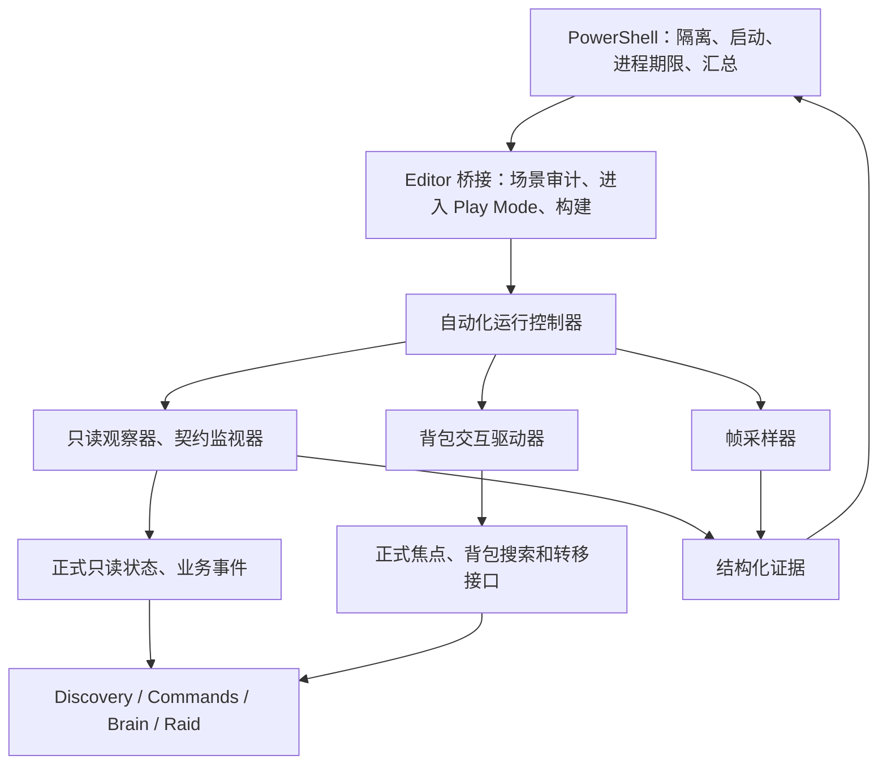

# Scenezl_Final 1 自主搜打撤，运行时诊断和性能治理大规划

日期：2026-09-11。状态：**用户已授权自主实施。层级/RaidFlow、P0–P2、P4a–P4e 已完成相应阶段。P3 已修复会话归属、满包撤离、地表追击、反击交接、资源完成、仓库定义和结算事务，原场景已有 4 倍速零失败撤离，1 倍速整局完成契约离线复核通过；仍在收敛间歇导航问题和重复运行矩阵。60 FPS 尾部门槛、独立 Player 和最终验收尚未通过。退出挂起根因未确认，按用户要求保留 Editor，停止反复退出调查。**

目标场景：`Assets/Scenes/Scene_DB/Scenezl_Final 1.unity`。源码调查基线：`c8b1a4c`。

实施按“小规划 → 实现 → 运行测试/Review → 调整 → 提交 → 下一阶段”推进。当前基线已更新到用户的 `3f068d6`，包括新地形和 NavMesh；P0 实测见 [p0_execution.md](p0_execution.md) 和 [p0_baseline.json](p0_baseline.json)。原始场景调查、用户 Profiler 数据和源码证据见 [scene_analysis.md](scene_analysis.md)，真实 Prefab、实例覆盖和第 3 项核对见 [prefab_configuration_audit.md](prefab_configuration_audit.md)，方案自审见 [architecture_review.md](architecture_review.md)。

## 1. 需求、范围和完成定义

### 1.1 已确认约束

1. 使用用户确认的 Scenezl_Final 1 正式内容，保持出生点、敌人、资源、NavMesh、相机和画面效果作为初始基线。
2. 两个游戏 Agent 自主决定目标，执行移动、搜索、交战、反击和撤离。**测试程序代替玩家操作背包**，用户不需要自己进入 Play Mode、点击 UI 或收集日志。
3. 完整流程中测试程序不调用 SubmitDirective/CommandRouter 发出 Search、Engage、Extract，不直接写黑板、资源完成状态、撤离计时、角色位置或结算结果。
4. 编码 Agent 自动打开隔离副本、进入真实 Play Mode、处理背包、采样、收集证据、定位问题、构造最小用例、修复、复跑，直到本次验收门禁通过。
5. 60 FPS 是用户最新确认的整局目标，不能用只站在开场、空场景、关闭渲染或平均 FPS 代替。4K 高画质保持，历史 120 FPS 诊断报告保留原口径。
6. 已知热点明确纳入：Discovery Update 85.43 ms，两个 Pawn Update 合计 15.55 ms，13 次 Zone Update 合计 10.69 ms。完整 Total/Self/Calls/GC 数据保存在调查文档中，后续按同一含义对比。
7. 按本次修改范围选择必要测试。旧 75 例构造回归可复用相关组，不每阶段跑全项目，更不能拿旧的 225/225 结果证明这张场景已通过。

### 1.2 本次目标

- 原场景无目标指令输入时能够正常初始化，注册两个角色、实际资源/敌人、可达撤离目标。
- 测试程序通过真实背包链完成发现内容、等待搜索、合法转移、保存会话，不替 Agent 选择下一目标。
- 验证自然发生的搜索和战斗，两个角色自行撤离，正确结算携带物品到隔离仓库，成功 UI 状态和持久化数据一致。
- 覆盖启动、移动、搜索等待、背包暂停、双人并发、交战、受击中断、撤离读条和结算，发现运行时 bug 和性能问题。
- 为每个问题留下可重现输入、前后证据、代码归属、修复和必要回归，不以“看起来走完了”作为结论。
- 交付可重复运行的入口、机器可判读报告、真实整局轨迹、性能原始样本和阶段审查。

### 1.3 非目标

- 不新增正式游戏自动拾取系统，不自动消费天赋、换流派或作弊装备，不重做菜单、商店或局外配装。
- 不要求自然一局清空所有区域和全部 Boss。搜打撤要求有真实搜索、真实战斗和撤离证据；路线未覆盖的区域另外标明。
- 不通过关闭敌人、伤害、墙体检测、特效、海面、阴影，或缩小背包物品/增加背包容量取得最终通过。
- 不先重构整个 AI 或渲染框架。用户给出的三个热点优先，其他模块必须有实际证据才进入修复。
- 不承诺任意设备、任意画质、无限随机运行永远没有 bug。结论限定于锁定配置、用例矩阵和实际运行次数。

### 1.4 满包边界：已确认自主撤离，保留剩余物品

用户已经确认：**满包后 Agent 自主撤离，保留箱内剩余物品。** 源码中资源群会把箱子设为资源点，必须取空才完成；5×6 背包无法保证装下全场内容。测试程序不能清空剩余物品或标记箱子已取空。

正式规则：真实搜索完成、经过合法放置/堆叠仍无法继续收纳时，游戏 Agent 自主转入撤离，剩余物品保留。这是显式的玩法边界补齐，不伪装成原有规则。容量阻塞属于当前 Agent 的事实，不把箱子或整群全局标为完成，也不能阻止另一名仍有空间的 Agent 继续取物。

P3 小规划细化正式库存事实到 Agent 决策的接口，再实现和测试。背包驱动仅执行合法背包操作，不能承担撤离策略。若自然一局没有遇到容量阻塞，容量用例仍必须单独执行。

## 2. 场景模型和必须先解决的接线问题

实际模型为：**场景配置 → 生命周期注册 → Discovery 候选 → 指令生命周期 → Brain 执行 → 背包/战斗/撤离业务 → 结算**。

优先级最高的场景问题：

| 项目 | 当前证据 | 首项验收 |
| --- | --- | --- |
| 撤离候选缺口 | 工程有 ExtractionCluster.prefab，但目标场景及递归 Prefab 来源没有撤离群组件；A/B 是 `IslandWallLayoutRoot/Markers` 下的普通场景点。群的全局注册与 Zone 归属是两条接线，缺 Zone 只告警 | 加载原场景后输出裸出口数量、注册撤离群数量、点到群映射、每个 Agent 的可达出口。先保留失败基线，再用现有 Authoring 补群、显式成员和 Zone；保留 A/B 的位置、3.2 秒时长、0.08 检测范围 |
| 多来源 RaidFlow | 场景对象、Canvas prefab、独立 RaidFlow prefab 都引用控制器 | 记录实际胜出实例、配置、销毁和初始化次序。场景应具有明确的局内流程所有者 |
| 重复目标 ID | 12/11 个重复 prefab 实例没有场景 TargetId 覆盖；另有六对直接 Zone/名称带 2 的 Prefab Zone 共用 ID。Registry 运行时有 GUID 重生逻辑 | 导出稳定场景身份到运行时 ID 的映射，检查告警、索引完整性和卸载清理；不因同名直接删除区域 |
| 实例覆盖改变资源归属 | 一个资源群父级是龙骨礁、显式 Zone 却是员工食堂；渔村另一个资源群唯一成员被覆盖为空，见 S09/S10 | 输出实际源对象、数组覆盖、点到群/群到 Zone 映射，区分明确空引用、Prefab stripped 引用和合法跨层级配置 |
| 多角色 presence | 触发器只缓存一个角色，执行节点还会主动汇报进入/离开 | 两个角色同点独立计时，不能互相取消，也不能在反击或离开后继续计时 |
| 地形/停靠/高差 | 原有 NavMesh、零交互距离、出生高差、大量资源成员 | 到达箱边与出口必须通过真实路径和范围判断，不能以测试 Warp 或清空障碍兜底 |

上表和 S01–S10 来自初始调查快照，不能直接视为修改后的现状。用户后续授权的层级修复已完成，当前展开为 8 个 Zone、28 个 Cluster，雨林和龙骨礁各有一个有效撤离群，见 [hierarchy_repair_execution.md](hierarchy_repair_execution.md)。P0 以新场景重新核对其余问题；接线通过不代表背包、战斗、结算或性能已通过。

## 3. 总体架构和依赖方向

采用四层结构，正式 Gameplay 保留原有模块边界。



- **进程层**：复用已有隔离能力，新增场景运行入口。处理版本、LFS、源快照、独占锁、命令行、超时、退出、证据完整性；不实现玩法。
- **Editor 层**：导出含 prefab 展开的真实对象清单，按路径打开原场景，进入/退出 Play Mode；另负责独立验证 Player 构建。不承载帧间游戏状态。
- **Automation 层**：同一份运行控制器用于 Editor 和显式启用的验证 Player，负责背包自动操作、只读断言、有限状态机、证据、性能采样。它可依赖 Gameplay，Gameplay 不依赖 Automation。
- **Gameplay 层**：目标策略留在 Discovery/Decision，指令留在 Commands，移动留在 Navigation，资源全局状态留在 Targets/Backpack，presence/结算留在 Raid。只增加必要业务观察事件、共用交互接口、局部 Marker 和已经复现的修复。

Automation 的运行时代码使用 `UNITY_EDITOR || ANOMALY_SCENE_AUTOMATION` 编译边界。普通正式 Player 不包含自动运行器，不会启动背包机器人。验证 Player 在隔离构建时显式定义宏。运行时文件不引用 NUnit、UnityEditor；Editor 文件继续留在预定义 Editor 程序集中，不为本任务迁移业务 asmdef。

### 3.1 关键设计决策

1. **完整场景单独入口**：不继承会创建空场景的 `ReproductionTestFixture`；旧微型夹具仍用于定位后的精简复现。
2. **背包驱动不持有目标决策权**：只消费正式搜索节点报告的“这个 Agent 已到达这个资源，正在等待交互”。不能重新调用 Collector 挑一个更容易的箱子。
3. **事件观察，快照验证**：复用指令反馈，给资源交互补一个小型业务事件；背包、Raid 私有状态初期集中只读观察，必要的对外只读契约在小规划中收敛。禁止反射修改结果。
4. **身份可重放**：日志同时保存场景/prefab 身份、AgentId、运行时 TargetId、CommandId。InstanceID 和自动 GUID 不作为跨进程唯一重放依据。
5. **完整候选与调度分离**：性能优化可以分帧计算和缓存，但不能让尚未扫描到的合法敌人永久消失，也不能发布半份候选冒充完整比较。
6. **查询缓存和执行状态分离**：候选可达性缓存归 Targeting；实际路径和移动监视归 NavigationMotor；资源几何候选归 ResourceCluster。失效规则明确，不能共用可变 NavMeshPath 污染另一角色。
7. **逻辑测试允许加速，性能测量使用正常速度**：用户最新确认逻辑测试使用 4 倍速；关键时间/物理边界保留 1 倍速回归，60 FPS 验收固定 1 倍速。移动/战斗仍走游戏时间，不手动推进 Physics；保留原 fixedDeltaTime 的游戏时间步长，避免靠增大物理步长加速。背包搜索仍走正式 unscaled 时间，进程硬期限用单调墙钟。
8. **先诊断，再轻量验收**：详细日志/Profiler 捕获和最终 FPS 分开配置。同一行为契约都要通过，最终不连接 Deep Profile、不逐帧 Debug.Log。

### 3.2 采用的模式

- 有限状态机：控制一轮运行、背包会话和超时，禁止散落无限协程。
- Adapter：包装正式背包开关/转移、只读旧接口、Editor 运行方式，测试不复制生产算法。
- Observer：指令和交互事件驱动诊断，避免逐帧全场扫描。
- 有界缓冲与批量写入：保存帧样本和事件，控制观察开销，输出丢失计数。
- 按版本/位置失效的短期缓存、增量扫描：只在热点实测后实施；关键是查询预算和正确失效，不是永久缓存结果。
- 按变化更新范围：Zone 状态聚合与几何重建分别处理，动态群保留可控刷新。

## 4. 目录结构、文件职责和 Reuse / Extend / Wrap / Create

下列均为**拟实施的具体文件**。新增文件按阶段创建，非本轮已实现清单。所有新增 Unity 文件配 `.meta`，保留现有资产 GUID。除已明确列出的接口外，如需改变重要边界，先更新方案。

### 4.1 运行和证据

| 决策 | 具体文件 | 职责与独立理由 |
| --- | --- | --- |
| Reuse | `tools/agent-repro/AgentRepro.Workspace.psm1` | Unity 版本、源快照、LFS、外部副本、所有权和锁；运行前检查它是否覆盖本轮新增输入 |
| Create | `tools/agent-repro/Invoke-SceneRaid.ps1` | 场景运行编排，支持审计、Editor 基线、完整回合、性能、Player 复核；不把长回合逻辑塞进旧微测试入口 |
| Create | `tools/agent-repro/SceneRaid.Report.psm1` | 校验回合契约、帧样本、进程结果、哈希和覆盖率，合成最终状态 |
| Create | `tools/agent-repro/scene-raid-cases.json` | 用例 ID、模式、预期检查点、种子、期限和覆盖范围 |
| Create | `tools/agent-repro/scene-raid-profiles.json` | 场景路径/GUID、4K画质、采样/诊断配置、性能阈值；配置独立于断言实现 |
| Create | `tools/agent-repro/Test-SceneRaidReport.ps1` | 构造缺失结果、假成功、计数器缺失、掉帧、异常退出等报告故障，不启动 Unity |
| Extend | `tools/agent-repro/README.md` | 加入真实整局入口、自动背包边界、证据判读；保留原有微测试入口 |

### 4.2 Editor 桥接

| 决策 | 具体文件 | 职责与独立理由 |
| --- | --- | --- |
| Create | `Assets/Scripts/Editor/AgentReproduction/SceneRaid/SceneRaidEditorEntry.cs` | 读取本轮配置、选择 Game View、加载指定场景、进入/退出 Play Mode、恢复设置；跨 Domain Reload 保留启动状态 |
| Create | `Assets/Scripts/Editor/AgentReproduction/SceneRaid/SceneRaidSceneAudit.cs` | 在本轮 GUID/fileID 核对基础上，通过 Unity 展开 prefab，记录源路径、源对象、实例覆盖、增删记录、SO，导出世界坐标、层级、组件、绑定、NavMesh/Collider/渲染资源清单；不自动修正被测场景 |
| Create | `Assets/Scripts/Editor/AgentReproduction/SceneRaid/SceneRaidBuildEntry.cs` | 在隔离副本构建同场景验证 Player，显式控制宏、画质和 Frame Timing 配置；不改正式 Build Settings |
| Reuse | `Assets/Scripts/Editor/AgentReproduction/Infrastructure/RuntimeWait.cs` | 微用例的有限等待模式；长回合控制器使用自己的墙钟期限，不依赖 Editor 类型 |
| Reuse | `Assets/Scripts/Editor/AgentReproduction/Infrastructure/ReproductionTestFixture.cs`、`Assets/Scripts/Editor/AgentReproduction/World/TestNavMeshBuilder.cs`、`Assets/Scripts/Editor/AgentReproduction/World/AgentFactory.cs`、`Assets/Scripts/Editor/AgentReproduction/World/EnemyFactory.cs`、`Assets/Scripts/Editor/AgentReproduction/World/TargetFactory.cs` | 仅用于缩小后的定向用例，不替换整局原场景 |

### 4.3 Automation 运行层

统一目录为 `Assets/Scripts/Automation/SceneRaid/`，不放到 Gameplay/Agent 或 Backpack 中。

| 决策 | 具体文件 | 职责与独立理由 |
| --- | --- | --- |
| Create | `Assets/Scripts/Automation/SceneRaid/SceneRaidScenarioConfig.cs` | 配置和输出 DTO：模式、期限、种子、测量配置、允许的背包动作；无场景扫描 |
| Create | `Assets/Scripts/Automation/SceneRaid/SceneRaidBootstrap.cs` | 在指定自动化会话中尽早安装观察、初始化随机源，确保覆盖场景 Awake/OnEnable；普通运行不激活 |
| Create | `Assets/Scripts/Automation/SceneRaid/SceneRaidRunController.cs` | 回合状态机、生命周期、外部期限、各组件协调；不含背包转移算法或性能统计公式 |
| Create | `Assets/Scripts/Automation/SceneRaid/SceneRaidObserver.cs` | 订阅业务事件，采集角色/目标/导航状态，生成状态变化记录；不调用目标选择或发指令 |
| Create | `Assets/Scripts/Automation/SceneRaid/SceneRaidReadModel.cs` | 把现有公开接口及必要私有只读观察转换成快照；缓存元信息，反射集中于此，不允许写操作 |
| Create | `Assets/Scripts/Automation/SceneRaid/SceneRaidIdentityMap.cs` | 场景对象与动态生成对象的稳定身份映射，源群/出生点/生成序号关联；和业务 TargetId 分开 |
| Create | `Assets/Scripts/Automation/SceneRaid/SceneRaidInventoryDriver.cs` | 公平调度两名 Agent 的真实背包会话、搜索等待、合法转移和关闭；不持有游戏策略 |
| Create | `Assets/Scripts/Automation/SceneRaid/SceneRaidContracts.cs` | 根据快照/事件检查停滞、串会话、目标失效、撤离、库存守恒；没有修改被测状态的能力 |
| Create | `Assets/Scripts/Automation/SceneRaid/SceneRaidFrameSampler.cs` | 帧间隔、ProfilerRecorder/FrameTimingManager 有效值、GC 和阶段标记；不做游戏成功判定 |
| Create | `Assets/Scripts/Automation/SceneRaid/SceneRaidEvidenceWriter.cs` | 有界缓存、结构化文件、序号、丢失计数、完成标记；不在采样时同步逐行刷盘 |

这批文件是单一场景自动化能力的职责划分，不建设任意游戏通用测试平台。稳定身份表在加载审计和生成变化时维护，禁止每帧遍历所有 Transform。

### 4.4 最小业务可观察性和共用交互入口

| 决策 | 具体文件 | 职责、拟定接口及边界 |
| --- | --- | --- |
| Reuse | `Assets/Scripts/Gameplay/Agent/Commands/AgentDirectiveFeedbackChannel.cs`、`Assets/Scripts/Gameplay/Agent/Commands/AgentDirectiveResult.cs` | 观察接受/拒绝/挂起/恢复/结束；不创建第二套任务生命周期 |
| Create | `Assets/Scripts/Gameplay/Agent/Data/AgentResourceInteractionEvent.cs` | 只读交互事件：AgentId、CommandId、实际资源对象、进入等待/离开/完成原因；数据独立于日志 |
| Create | `Assets/Scripts/Gameplay/Agent/Runtime/AgentResourceInteractionChannel.cs` | 发送上述业务事件，无任务队列和玩法状态；无 Automation、文件系统依赖，重载时清理静态订阅 |
| Extend | `Assets/Scripts/Gameplay/Agent/AI/Actions/SearchResourceActionNode.cs` | 在真实到达等待、失去范围、中断、完成时发送去重事件；仍由正式节点决定能否交互 |
| Wrap | `Assets/Scripts/Automation/SceneRaid/SceneRaidInventoryDriver.cs` | 包装 `AgentRuntimeRegistry.TrySetFocusedAgent`、`LootBoxEntity.Interact`、`InventoryScreenController.CloseInventory` 等真实动作 |
| Extend | `Assets/Scripts/Gameplay/Backpack/DraggableItemUI.Drag.cs`、`Assets/Scripts/Gameplay/Backpack/DraggableItemUI.State.cs` | 将快捷转移整理为共用 `TryQuickTransfer` 入口，点击和自动化都调用；保留搜索、会话、布局、堆叠等全部前置约束，返回是否成功及失败原因，不新增“强制放入”路径 |
| Reuse | `Assets/Scripts/Gameplay/Backpack/InventoryGridInteractionPolicy.cs`、`Assets/Scripts/Gameplay/Backpack/InventoryGridPlacementPolicy.cs`、`Assets/Scripts/Gameplay/Backpack/InventoryScreenSessionContext.cs`、`Assets/Scripts/Gameplay/Backpack/InventoryUIController.cs` | 沿用已实现的交互、装箱、会话和运行时物品状态，不复制算法到测试中 |
| Reuse | `Assets/Scripts/Gameplay/Agent/Runtime/AgentRuntimeConsoleDebugDumper.cs` | 失败时一次性 DumpAllAgents，补充人工也可读的快照；不用 I 键触发，避免与背包快捷键混淆 |

必要的伤害/结算归因先复用现有状态和日志上下文。若快照不足以证明单次事件，不通过高频全场扫描补救，而是在对应小规划中列出具体业务事件和文件后补齐。

### 4.5 修复和优化归属

| 决策 | 具体文件 | 计划处理的职责 |
| --- | --- | --- |
| Extend | `Assets/Scenes/Scene_DB/Scenezl_Final 1.unity` | 正式场景接线：补齐出口群关系、唯一流程所有者、实例身份。通过 Unity 序列化编辑，保留美术和场景布局 |
| Reuse | `Assets/Prefabs/Cluster/ExtractionCluster.prefab`、`Assets/Scripts/Gameplay/Targets/Authoring/ExtractionClusterAuthoring.cs` | 用现有群抽象及资产接线作为模板接入 A/B，显式填写成员和 Zone；不新增裸出口发现服务，不用 Prefab 的 3 秒/范围 1 覆盖场景的 3.2 秒/范围 0.08 |
| Extend | `Assets/Scripts/Gameplay/Raid/ExtractionPointController.cs`、`Assets/Scripts/Gameplay/Raid/RaidFlowController.cs`、`Assets/Scripts/Gameplay/Agent/AI/Actions/ExtractActionNode.cs` | 若实测证实，修复多 Agent presence、动作中断和结算一致性；计时/库存归属保持现有分层 |
| Extend | `Assets/Scripts/Gameplay/Agent/Runtime/AgentTargetDiscoveryController.cs`、`Assets/Scripts/Gameplay/Agent/Targeting/AgentTargetCandidateCollector.cs` | H01：候选的保守预筛、扫描预算、避免重复查询，仍采用原目标比较策略 |
| Create，按采样启用 | `Assets/Scripts/Gameplay/Agent/Targeting/AgentTargetScanSession.cs` | 持有单 Agent 增量扫描游标和待发布完整结果；调度仍归 Discovery/Decision，不另造 AI 管理器 |
| Create，按采样启用 | `Assets/Scripts/Gameplay/Agent/Targeting/AgentTargetReachabilityCache.cs` | 单 Agent 的短期可达性事实，键含对象/空间/导航版本；不缓存全局永远有效的判断，不保存可共享修改的路径对象 |
| Extend | `Assets/Scripts/Gameplay/Targets/Authoring/ResourceClusterAuthoring.cs` | 资源成员和几何候选所有权，修复缓存失效，避免远处资源先计算全部路径；不接管 Agent 策略 |
| Extend | `Assets/Scripts/Gameplay/Agent/Navigation/AgentNavigationQuery.cs`、`Assets/Scripts/Gameplay/Agent/Navigation/AgentNavigationMotor.cs` | H02：把实际路径重算频率和移动监视分开，重用受控缓冲，仍及时发现断路/离开/高差，不只限 SetPath |
| Extend | `Assets/Scripts/Gameplay/Agent/Core/AgentPawnRoot.cs`、`Assets/Scripts/Gameplay/Agent/Core/AgentBrainController.cs`、`Assets/Scripts/Gameplay/Agent/Commands/AgentDirectiveLifecycleController.cs`、`Assets/Scripts/Gameplay/Agent/AI/Actions/SearchResourceActionNode.cs`、`Assets/Scripts/Gameplay/Agent/AI/Actions/EngageEnemyActionNode.cs` | H02：分解属性刷新、生命周期、Brain、Search/Engage 的实际成本；搜索等待不重复整群寻路；普攻/技能冷却和受击响应不降频 |
| Extend | `Assets/Scripts/Gameplay/Targets/Authoring/TargetZoneAuthoring.cs`、`Assets/Scripts/Gameplay/Targets/Authoring/GameplayTargetClusterAuthoringBase.cs`、`Assets/Scripts/Gameplay/Targets/Authoring/ActiveEnemyClusterAuthoring.cs`、`Assets/Scripts/Gameplay/Targets/Runtime/GameplayTargetShapeUtility.cs` | H03：状态聚合、范围版本、几何重建、地面投射、显示更新分离；静态按变化更新，动态有界刷新 |
| Extend，须有实测证据 | `Assets/Scripts/Gameplay/Perception/TargetVisibilityQuery.cs`、`Assets/Scripts/Gameplay/Perception/CombatAimPointResolver.cs`、`Assets/Scripts/Gameplay/Raid/PerspectiveWallFadeController.cs`、`Assets/Scripts/Gameplay/Raid/PerspectiveFadeWall.cs`、`Assets/Scripts/Gameplay/Raid/RaidMinimapController.cs` | 感知/墙体/小地图分配和重复查询，保持空间正确性、画面和焦点行为 |
| Extend，须有实测证据 | `Assets/Scripts/Renderer/FFTSea/OceanFFTGenerator.cs`、`Assets/Scripts/Renderer/FFTSea/FFT2D.cs` | 局部 FFT 缓冲复用和重复计算定位。共享模拟、材质所有权重构若需要，另补架构小规划，不在此预先创建模拟服务 |
| Review 后才修改 | `Assets/Settings/URP-HighFidelity.asset`、`Assets/Settings/URP-HighFidelity-Renderer.asset`、`Assets/Scenes/Scene_DB/Scenezl_Final 1.unity` | GPU 热点确认后提出保持画面意图的方案，不直接降分辨率、关效果通过验收；其他材质资产如需调整，在小规划列明实际路径 |

满包自主撤离规则已确认。P3 在 `Assets/Scripts/Gameplay/Backpack/InventoryScreenController.cs`、`Assets/Scripts/Gameplay/Backpack/DraggableItemUI.Drag.cs` 中确定正式容量/转移事实入口，在 `Assets/Scripts/Gameplay/Agent/AI/Actions/SearchResourceActionNode.cs`、`Assets/Scripts/Gameplay/Agent/Runtime/AgentTargetDiscoveryController.cs` 中确定搜索退出和撤离决策归属；需要按 Agent 保存的事实由既有 Agent 状态边界承担。小规划列清具体字段、接口和必要新增数据文件，再进入实现；Automation Driver 不直接发撤离命令。

## 5. 自动执行闭环

### 5.1 一轮运行

```text
校验源码/资产 → 获得独占副本 → 写入 run 配置 → 安装观察和种子
→ 按路径打开原场景 → 实际进入 Play Mode
→ 记录 Awake/OnEnable/Start 和原始初始状态
→ 观察 Agent 自主决策 → 仅在真实等待资源交互时处理背包
→ 观察自然战斗、受击、继续行动 → 自主选择并到达撤离点
→ 两名 Agent 各自计时完成 → 验证成功 UI、库存和仓库
→ 写入完成标记 → 退出 Play Mode/进程 → 核对结果完整性和源码哈希
```

运行器不能通过“先等待一切正确，再开始记录”掩盖初始化问题。就绪检查只用于报告阶段和开始性能稳态窗口，观察器从场景初始化前安装。启动期异常和自动产生的错误指令也算结果。

### 5.2 模式

| 模式 | 行为 | 用途 |
| --- | --- | --- |
| Audit | 加载并只读导出场景/配置/层级，不改源资产 | 建立真实数量和接线清单 |
| Observe | 真实 Play Mode，完全不执行背包动作，最长 60 秒或到首个稳定等待点 | 复现用户“没有下达指令就出问题”的开局；正常等待背包标为预期等待，不误报卡死 |
| AutonomousRaid | 自主目标和战斗，启用背包驱动，详细事件和有限快照 | 定位到完整撤离闭环，任何救援动作都使完整回合失去验收资格 |
| PerformanceRaid | 相同规则、原内容、真实渲染，降低诊断成本，逐帧记录时间 | 60 FPS 门禁；不能只挑轻负载片段 |
| FocusedRepro | 根据失败的场景对象/配置构造最小用例或明确的场景变体 | 验证单个根因。可在开始前布局，但标为定向构造，不算自然整局 |
| PlayerVerify | 同一场景和 Automation 逻辑，独立验证 Player | 区分 Editor 附加开销，检查实际渲染和完整链；结果与 Editor 分开 |

逻辑轮次的 `simulationSpeed` 写入 `tools/agent-repro/scene-raid-profiles.json` 和 `Assets/Scripts/Automation/SceneRaid/SceneRaidScenarioConfig.cs`，由既有 `SceneRaidRunController.cs` 在场景初始化后应用和清理。记录请求倍速、实际 Time.timeScale、游戏时间/墙钟推进比及暂停区间；不能因填写 4 就声称实际快 4 倍。背包自身保存/恢复暂停前速度，驱动不得逐帧覆盖暂停或结算时钟；关闭后应恢复为该轮速度。加载、UI 搜索和硬期限不简单除以倍速，行为期限按游戏时间判断。异常退出、重载后恢复原时间配置。加速轮的帧数据仅用于诊断，不颁发性能通过；首次加速和速度相关失败用相同输入在 1 倍速复核。

### 5.3 进程、存档和时间

- 复用已有外部隔离根和所有权标记，源工程保持不被 Play Mode、存档、导入设置改写。每轮记录 commit、dirty diff、输入哈希、Unity 版本和完整命令。
- 初期所有 Unity 运行串行。性能采样不同时运行另一份 Unity、构建或压力程序；不擅自关闭用户的应用。检测到竞争则记录并重跑，原失败证据保留。
- 只结束启动器拥有的 PID/进程树，输出心跳、运行阶段和 deadline。长时间导入、加载、游戏暂停均有独立期限。
- 建议初始期限：导入/构建 30 分钟；加载 120 秒；就绪检查 15 秒；自然回合 20 分钟游戏时间、30 分钟墙钟。按首次路线/搜索量说明后可修订，不能无限增加期限掩盖停滞。
- 场景和资源规模可能导致合理长路程。正常移动按路径进展判断，不因目标很远就当作卡死。稳定等待背包、搜索 unscaled 进度和撤离读条分别判断。
- 冷启动至少保留一轮，新进程重复和同 Editor 重载都需要覆盖。旧测试关闭 Domain Reload 是夹具适配，完整场景还要验证正常 Domain Reload 路径，检查静态事件、Singleton 和存档服务清理。
- 种子在场景生命周期前安装，记录实际使用的随机源；Unity Random、System.Random、Guid 和基于时间的种子分别处理。相同种子不等于物理轨迹逐帧确定，稳定身份和状态序列辅助重放。

## 6. 背包驱动的具体规则

### 6.1 驱动状态机

`等待交互事件 → 校验 Agent/CommandId/实际资源 → 排队 → 切焦点 → 打开正式会话 → 等待搜索 → 合法转移 → 关闭会话 → 等待游戏自行推进`。

- 同时只处理一个背包会话。按进入等待的先后和 AgentId 稳定排序，防止某个角色长期饥饿。
- 开始前及每次操作前都验证角色活着、目标仍匹配、资源有效、交互范围仍满足。测试不自己调用导航把角色带回来。
- 切焦点使用 Registry 正式接口；等待 `ActiveInventoryAgentId` 和 UI 上下文一致后再操作。关闭当前会话后才服务另一角色。
- 在框架报告的实际箱子上调用正式 Interact/开箱入口，保存会话对象身份。不能遍历全地图先把箱子搜索完。
- 等待 UI 的真实 `IsSearched`/进度变化。使用 unscaled time，不直接写搜索时长、IsSearched 或格子数据。
- 对已搜索物品按稳定的布局顺序调用共用转移入口；每次验证来源减少量、目标增加量、堆叠和旋转结果。数值、容量、装备槽规则保持正式逻辑。
- 关闭后验证 Time.timeScale/fixedDeltaTime 恢复、资源剩余内容已写回、焦点库存归属正确。时间恢复由正式 UI 执行，测试不能每帧强制 Time.timeScale=1。
- 到达/失去范围/中断事件成对清理。命令变化、资源失效或会话错配时结束当前驱动，保存失败/中断原因，不继续操作旧对象。

### 6.2 容量、未取完和公平性

测试驱动只负责说明“哪些真实物品已搜索、哪些转移成功、哪些因空间或规则无法转移”。不能把“背包没有矩形空位”简化成已占满全部格子，也不能把一个超大物品放不下当作所有物品都放不下。

经过所有合法候选后仍不能转移，记录 `InventoryCapacityBlocked`，关闭会话，交给已确认的正式游戏策略处理。等待该策略的有限时间后仍重复同一资源，则报告闭环阻断。**不扩大背包、不删 loot、不自动出售、不把东西写进局外仓库、不发撤离指令**。

测试程序的焦点切换会影响镜头。所有完整性能回合采用同一会话调度，输出 FocusChanged 事件，便于按同样的视角阶段比较；额外相机压力路线单独标为定向性能测试。

## 7. 日志、诊断和失败证据

### 7.1 事件和快照

| 类别 | 记录内容 |
| --- | --- |
| 环境 | runId、用例/种子、源码/场景/依赖哈希、编辑器/Player、图形设备/API、分辨率、画质、帧率限制、重载配置 |
| 角色/命令 | AgentId、稳定对象身份、位置、HP/护盾/防御、宏状态、节点、CommandId、请求来源、目标群/成员、生命周期/失败原因 |
| 导航/发现 | isOnNavMesh、pathStatus/pathPending、目标/停靠点、remainingDistance、速度、进展时间、群/成员/候选数量、射线/CalculatePath/SetPath 次数、缓存命中/失效、扫描年龄 |
| 搜索/背包 | 实际资源、会话序号、归属 Agent、搜索进度、搜索/转移/关闭事件、容量和剩余物品、物品类型/数量/价值变化 |
| 战斗 | 参战对象、目标绑定、血量变化/击杀、受击反击、空间失败原因、技能/普攻活动；必要时输出既有伤害上下文 |
| 撤离/结算 | 进入/离开原因、presence 来源、逐 Agent 读条、要求撤离集合、已撤离/已结算集合、前后库存/仓库、成功/失败 UI |
| 性能 | 单调时间戳、frameId、真实帧间隔、主线程/渲染线程/GPU 可用耗时、GC bytes、各 Marker 耗时/调用数、游戏阶段和是否在背包暂停 |

正常事件只在变化时记录，状态快照建议 2 Hz。每帧只更新计数器和紧凑样本，不构建大型字符串，不调用 DumpAllAgents，不做全场 FindObjects，不同步 JSON 序列化/刷盘。

保留有界的失败前约 20 秒快照环形缓冲、完整关键事件和帧样本。异常触发额外导航角点/目标/Collider 快照、一次 Console Dump、必要截图和短时 Profiler 捕获。原始首次异常堆栈不能被去重丢掉，重复日志保存计数和首末时间。

### 7.2 文件和判定权威

```text
Logs/SceneRaid/<run-id>/
  manifest.json               源快照、运行配置、命令和输入哈希
  scene-audit.json            实际层级和资产绑定
  identity-map.json           场景身份、运行时 ID、出生来源
  events.jsonl                关键状态变化和背包动作
  snapshots.jsonl             有限频率快照
  frames.csv                  帧样本、阶段和有效性
  counters.json               Marker/计数器描述和可用性
  inventory-ledger.json        来源→背包→结算→仓库核对
  contracts.json              每条契约的通过/失败/未覆盖
  performance.json            分阶段分位数、慢帧、阈值结果
  failures/<id>/              失败输入、上下文、截图/Profiler 文件
  Editor.log 或 Player.log    原始引擎日志
  completion.json             最终检查点、样本数量和文件哈希
  summary.json / report.md    汇总结论
```

文件名是拟定输出契约。可以扩展字段，不能用单独一句“Success”替代其它文件。机器结果区分 `PASS`、`BEHAVIOR_FAIL`、`PERFORMANCE_FAIL`、`ENVIRONMENT_ERROR`、`AUTOMATION_ERROR`、`COVERAGE_MISSING`。进程超时、异常退出、结果缺失、样本缺口、错误 GPU/分辨率不能算通过。

逻辑微测试由原始 NUnit XML 判定；完整回合要求控制器最终检查点、独立契约结果、进程正常结束和证据完整性同时成立。诊断模式“取证完成”的退出码不能解释为玩法通过。报告层用故障构造专门验证这点。

## 8. 60 FPS 验收设计

### 8.1 固定环境，分别记录 Editor 和 Player

建议主配置为本机 Ryzen 9 9950X3D、RTX 5090 D，**3840×2160、High Fidelity、RenderScale=1**，沿用现有 MSAA、SSAO、描边、阴影和场景内容。选择 4K 是依据本机显示输出的保守建议，不是已知的用户 Profiler 采样分辨率；该配置随本规划供 Review。

- 第一轮记录原 VSync/targetFrameRate/分辨率。性能轮在隔离进程中设置 VSync=0、targetFrameRate 不限，避免显示同步把性能上限掩盖掉；不改源项目默认值。
- Unity SystemInfo 确认实际 GPU、图形 API、驱动和运行后端，读取真实渲染尺寸。核显、虚拟设备、错误的 Game View 尺寸应导致环境失败。
- Editor 性能轮使用正常图形 Editor，Game View 实际渲染，固定窗口布局，关闭额外 Scene View 绘制和 Gizmos，记录这些诊断设置。不能用 Editor batchmode 或 `Camera.Render` 的离屏循环代表正常 Game View FPS。
- 独立 Player 复核使用相同场景、背包策略、画质和分辨率。Development/Profiler 轮用于定位，较轻的验证构建用于最终统计。构建类型、脚本后端、采样开关分别记录。
- **Editor Play Mode 体验是本次目标的一部分**。Player 通过、Editor 未通过时分别报告，不能以 Player 成绩宣称用户所要求的 Play Mode 已无性能问题。
- 1080p 或降画质只作为定位 CPU/GPU 的 A/B 实验，不能替代上述主配置达标。

### 8.2 统计和门槛

用户最新将原 120 FPS 目标改为 60 FPS。以下组合检查平均表现、持续低帧和单帧卡顿上限，不以平均 FPS 单项代替验收；测量进程仍不限帧，并不把游戏锁到 60 FPS。

| 指标 | 建议主门槛 |
| --- | --- |
| 整体吞吐 | 有效游戏区间平均 FPS ≥60，计算为帧数/真实持续时间，不平均逐帧 FPS |
| 持续低帧 | 每个滑动 1 秒窗口 FPS ≥60，采样步长 0.25 秒 |
| 尾部帧 | P99 帧间隔 ≤16.667 ms；1% Low ≥60 FPS，定义为最慢 1% 帧耗时均值的倒数 |
| 卡顿上限 | 可交互阶段单帧不超过 33.333 ms；所有 >16.667 ms 的帧保留，输出数量、最长连续段、阶段和来源；任何 >33.333 ms 都单列严重卡顿 |
| 分阶段 | 移动、搜索等待、真实战斗、撤离分别检查；背包暂停和结算显示另列，不混入较轻片段抬高游戏阶段成绩 |
| 初始化 | 导入/加载单独统计；进入 Play Mode 到可交互的耗时有明确期限，原始开局帧完整保存。首次交战/首次开箱不能临时算进预热而剔除 |

当前采用表中组合，不将其解释为每一帧都达到 60 FPS。允许的数值容差仅处理 CSV 时间舍入：帧预算 0.001 ms、FPS 0.001，不能借此忽略真实卡顿。历史 120 FPS 报告不重写；新统计明确保存 targetFps 和预算。

建议就绪后最多 10 秒预热，提前固定规则，预热期间游戏正常运行且照常做行为检查。游戏若在预热前进入战斗，也记录冷启动战斗成本；还要有覆盖相同战斗内容的稳态样本。自然回合过短或某阶段未发生时报告样本不足，不拉长结算界面时间凑样本。

低 FPS 可能来自 CPU、GPU、同步等待或测试开销。FrameTimingManager 的 CPU/GPU 数据不与墙钟帧间隔简单相加；报告中保留时延、数据可用性和来源。无效/缺失 GPU 数据用 unavailable，不能写 0 ms。计数器按当前 Unity 实际可用名称、单位枚举，纳秒换毫秒要验证。

### 8.3 三个热点的测量和局部预算

这些是拟定优化目标，不是当前实测成绩；最终必须同时满足整帧门禁。

| 入口 | 细分 Marker/计数器 | 建议稳态预算及验证 |
| --- | --- | --- |
| Discovery | CopyClusters、VisibleEnemyCandidates、WorldCandidates、ResourceGeometry、Reachability、SubmitValidation；每帧扫描成员、CalculatePath、Raycast、缓存命中、扫描年龄 | 两 Agent 合计 P95 ≤1 ms、P99 ≤2 ms；正常扫描不形成 80 ms 级突刺；预热后无持续扫描分配 |
| Pawn | BodyFacts、TotemRefresh、DirectiveTick、BrainTick、SearchTick、EngageTick、NavigationCheck、SetPath、ExternalMovement；按 AgentId/宏状态聚合 | 两 Agent 合计 P95 ≤1.5 ms、P99 ≤2 ms；等待同一资源不重复整群查询；静态目的地重算次数受预算控制 |
| Zone | AggregateState、BuildRangeShape、GroundProjection、ApplyLineRenderer；每个区域输入点、几何版本和更新次数 | 全部活动 Zone 合计 P95 ≤0.25 ms、P99 ≤0.5 ms；静态区域初始化后零重复重建；动态目标变更仍及时反映 |

采样使用局部 `Unity.Profiling.ProfilerMarker`，名称固定，不逐帧拼接含对象名的 Marker。按实例区分通过旁路计数/快照实现。GC 目标是消除这三个热点的持续非事件分配，事件期 UI/VFX 的有限分配单独分析，不能把“一次生成物品的分配”误算为泄漏。

### 8.4 不能用失去正确性换取速度

- 扫描预算同时限制角色数、成员数和昂贵查询数。计划初值可用每帧 4 次新候选完整路径查询、约 1 ms 扫描预算，P1 依据实测修订；单次同步 NavMesh 查询不能被时间预算中途切开，要单独测最坏一次耗时。
- 增量扫描保留最近完整结果，完成后原子发布。标明结果年龄；正常密度希望 ≤0.5 秒、压力密度 ≤1 秒，超过上限是性能/调度失败。新攻击伤害、目标死亡/撤离和当前路径失效不等待低频扫描。
- 先做保守空间剔除。群中心超范围不足以剔除群内近处成员，必须用能覆盖成员的边界或成员级距离。
- 缓存键至少包含 Agent 身份/导航类型/areaMask、起点变化、目标对象和停靠点变化；NavMesh 拓扑/障碍变化、启停/销毁、场景重载有明确失效，另设短期到期。旧“不可达”不能永久阻止新路径。
- 当前任务保持具体资源/停靠点，必要时重新验证。动态箱子、外部位移、墙体和断路用例确保缓存不会延续过期结果。
- 降低的是候选搜索和路径重算频率，不是生命伤害、角色移动、普攻冷却、枪口/弹体遮挡检测频率。
- Zone 的状态聚合、几何轮廓、视觉显示分别响应变更。静止区域不重建，敌人移动仍更新范围，点击命中和资源/敌人完成后显示保持正确。

### 8.5 观察成本和内存边界

采样器每帧只保存紧凑值，日志队列有容量、增长限制和丢失计数。详细取证开关和轻量帧采样开关分别比较。建议自动化观察代码自身稳态 P95 <0.2 ms，帧采样稳态 0 B 托管分配；超预算先修测试工具，不把观察开销归给游戏。

最终统计保留正常采样成本，不从已观测帧耗时中人为扣除。详细 Profiler/截图捕获产生的轮次只用于诊断，再跑轻量相同回合验收。运行期间真实刷盘造成的卡顿也要记录；不能事后删除相关帧。

通过同一 Editor 多次加载/卸载、同阶段对象数量和内存高水位检查泄漏。重点比较事件订阅、材料实例、纹理、NavMesh 数据、UI 项目和静态容器；不能用进程总内存短时抖动直接判泄漏，也不能每轮重启进程掩盖静态对象增长。

## 9. 可构造的用例和独立判定

### 9.1 原场景回合用例

| ID | 输入和运行方式 | 必须出现的证据 / 失败条件 |
| --- | --- | --- |
| SC00 原场景审计 | 只读加载指定 scene，展开 prefab，保存激活状态和世界坐标 | 两个不同 AgentId、有效配置/NavMesh、实际敌人来源/资源清单；两出口有候选注册路径；无 Missing Script/失效关键引用 |
| SC01 零操作开局 | 原场景进入 Play Mode，不下目标指令、不操作背包 | 观察自动目标和运行错误；合法等待背包为预期结果；错误请求、异常、无导航仍移动、无目标异常停滞要报告 |
| SC02 默认自主整局 | 原出生点、原装备/数值、自然敌人/loot，背包驱动启用 | 两个 Agent 各有真实资源交互，局内有真实敌人交战/伤害及击杀证据，所有要求撤离的角色自行撤离并正确入库 |
| SC03 相同种子复跑 | SC02 输入、画质和策略不变，新进程重复 | 检查结局、重要状态序列和库存一致性；允许物理轨迹细微差异，随机生成和 ID 映射可追踪 |
| SC04 不同种子 | 冻结的少量不同种子，保持正式 loot/敌人数值 | 不因固定一个好种子掩盖满包、不同掉落和战斗路径；失败种子保留并纳入回归 |
| SC05 同 Editor 重载 | 相同 Editor 正常退出 Play Mode，再加载原场景进入第二局 | 没有重复订阅、错误静态注册、旧任务、旧 UI 会话或库存串局 |
| SC06 真实渲染性能回合 | SC02 的玩法，4K 高画质，轻量采样 | 行为、覆盖和性能同时通过；不能只在角色提前死亡或背包暂停期间获得高帧率 |
| SC07 Player 复核 | 同一源码和自动化策略构建验证 Player | 自主闭环和性能分开输出，核对 build 场景、GPU、质量、存档、计数器有效性 |

整局成功的覆盖口径：要求每名角色有合法资源交互/携带物品证据，局内至少发生一次真实交战和击杀；逐角色记录战斗覆盖，不强迫未遇敌的角色凭空开火。若自然路线仅搜完就撤离，没有交战，则标为“撤离行为通过、搜打撤覆盖不足”，不能改路线或让测试伤害敌人补齐后称自然通过。先解释真实内容/路线，再决定是否调整验收种子或正式内容。

### 9.2 从实际失败缩小的逻辑用例

拟新增以下测试文件，每个文件只负责一个边界域：

- `Assets/Scripts/Editor/AgentReproduction/Tests/SceneExtractionPresenceTests.cs`
- `Assets/Scripts/Editor/AgentReproduction/Tests/SceneInventorySessionTests.cs`
- `Assets/Scripts/Editor/AgentReproduction/Tests/SceneAutonomyBoundaryTests.cs`
- `Assets/Scripts/Editor/AgentReproduction/Tests/SceneQueryBudgetTests.cs`

| ID | 构造内容 | 核心断言 |
| --- | --- | --- |
| EX01 | 同一正式出口，两个 Agent 同时抵达；A/B 分别带多 Collider | 每人仅一份进度，没有互相清零，没有重复结算 |
| EX02 | A 离开/反击，B 仍在读条；A 后续恢复撤离 | 只清 A 的进度；B 正常完成；A 保持原撤离任务身份和合法恢复 |
| EX03 | 在出口 Trigger 大范围边缘、高低层和有效范围外走过 | 未满足实际撤离条件不读条；没有 Extract 的路过角色是否会被自动撤走列为行为核验，不用测试禁用 Trigger 掩盖 |
| EX04 | A 先撤离，B 继续/死亡，或存档写入失败 | 结束条件、错误状态、物品保留/丢弃符合已确认规则；不能把销毁当成入库成功 |
| UI01 | 同时等待两个不同箱子，自动排队开关，反复切焦点 | 会话和库存始终属于正确 Agent，暂停/恢复成对，另一角色的资源不被误完成 |
| UI02 | 相同角色打开无关背包/另一箱子；原资源被移走或禁用 | 不把无关开关当作当前搜索完成，旧会话不提交到新目标 |
| UI03 | 真实小/大/可堆叠物品，格子碎片化，部分剩余，满包 | 正式转移尊重规则和数量守恒；不会因无法装下全部内容无界开关同一箱子；按确认的满包策略推进 |
| UI04 | 未搜索物品、搜索中关闭、重新打开、最后一件入包 | 不跳过搜索，不重复生成/扣除；close 写回的资源状态正确 |
| AU01 | 没普通候选、出口在发现范围外但可达；裸出口缺群对照 | 合法出口被自主选择；配置缺口清晰失败；无测试命令注入 |
| AU02 | 当前敌人死亡/撤离/禁用，另一合法敌人在场；近敌被墙遮挡 | 自动切换目标，完整扫描不漏候选；非法目标不再受伤 |
| AU03 | 从实际失败处复制箱体/坡面/导航、动态障碍、高差 | 仍受范围/射线/完整路径约束；失败后有界恢复或选择别处，不循环失败 |
| AU04 | 空箱、完成资源、剩余物品、多次失败、两 Agent 同群 | per-Agent 访问和全局资源状态不混淆，无假完成、无持续 A↔B 振荡 |

构造只在用例准备阶段明确改动环境，报告列出和原场景的差异。单例/缓存/事件清理检查属于这些测试的一部分。意外阵亡要分清数值平衡、空间 bug、背包驱动错误等原因；不通过给角色无敌或弱化敌人让默认成功用例变绿。

### 9.3 性能和缓存正确性用例

| ID | 构造输入 | 同时验证正确性和性能边界 |
| --- | --- | --- |
| PF01 发现扫描规模 | 使用原场景统计得到的群/成员规模 N，随后只做 N/2、N、2N 三档定向样例；包含远群近成员、不可达成员和隐藏敌人 | 记录单次最坏查询、每帧查询数、完整扫描延迟、GC；优化结果与小规模未缓存参考选择一致，不能靠丢候选提速 |
| PF02 当前任务保持 | 同一静态资源移动后等待，持续 10 秒；再移动角色/箱子、阻断路径 | 静态等待不全群重复寻路；变化能及时使缓存失效，仍恢复正确移动和交互 |
| PF03 范围更新规模 | 以用户样本中的 13 次 Zone 调用为线索，实际实例数审计后冻结，再建立静态/单成员移动/批量成员变动场景 | 静态零重建、动态更新有界，轮廓包含关系和目标状态准确，地面投射次数不按静态总量逐帧增长 |
| PF04 计数器和缓冲 | 空采样/采样开启/事件压力、无效 GPU counter、buffer 满、写盘失败 | 不把缺失记成零，不丢最终失败，日志量/队列有上限，观察自身开销可测 |
| PF05 次级热点 | 仅在主回合实测显示必要时，固定相机/场景比较 FFT、墙淡出、小地图和效果成本 | 保留画面基准和行为断言。开关功能的 A/B 只定位，最终恢复完整内容测量 |

不设置“调用某个方法一次所以测试通过”的镜像用例。正确性断言看外部行为/数量/空间条件，性能断言看可测预算和结果年龄。最终完整回合验证真实规模，不用 2N 压力场景替代正式内容。

### 9.4 无日志异常不等于无 bug

运行时独立监视器检查：

- 有可执行任务却长期 Idle；有移动意图却无路径进展；同一目标失败/重选超过有限阈值；目标循环且资源/伤害/路径没有进展。
- 角色死亡/禁用/已撤离后仍作为攻击接收者；目标绑定和受伤实体不一致；资源在错误会话后完成。
- 非背包/结算原因 Time.timeScale 长期为 0；搜索进度不变；会话无法释放；某个 Agent 长期排队得不到服务。
- 撤离计时在离开/反击期间增长，两个角色互相取消 presence，未结算就销毁，成功界面出现但仓库不一致。
- 数据/对象数量单调增长、日志风暴、帧样本缺失、UI 输入透传为目标指令。

默认软停滞探针可用“10 秒无行为进展且无合法等待”，重复同一失败可用“10 秒内 ≥3 次”。它们触发诊断，不单凭阈值立即判错；正式失败由具体上下文契约和硬期限决定，避免把绕路、冷却、暂停搜索误判为卡死。

## 10. 实施阶段

2026-09-11 最新顺序调整：用户要求优先修三个明显性能热点，先完成 P4a/P4b/P4c，再恢复 P2/P3 自主闭环。已写具体文件边界、测量和回归约束，见 [性能优先小规划](p4_performance_first.md)。既有 P2 实现及首轮有界运行保留，不继续追加慢速长回合。

每阶段开始先补 `pN_execution.md` 小规划，列本阶段实际文件、职责和必要用例；阶段结束记录首次失败、修复、复跑结果、证据路径、架构审查、是否调整后续计划。阶段提交使用项目既有前缀、自然中文正文，动作可用逗号衔接，默认不推送。

### P0：真实场景审计，建立失败基线

- 实现场景专用入口和只读审计，复用隔离/版本检查，验证正常进入/退出 Play Mode。
- 跑 SC00、SC01，记录运行时实际 Agent、Zone、敌人、资源、出口、NavMesh、UI 和单例；对照本轮 Prefab/实例覆盖核对 13 个 Zone、六对重复 Zone ID、资源显式归属和空成员；保存开局异常、ID 告警和首个等待点。
- 对 H01/H02/H03 做第一轮图形基线采样，核对用户样本是否可复现。先有有效 runId，不急着优化。
- 验收：原场景内容没有被工具修补；实际 Play Mode 和渲染可验证；失败/超时不会假通过；启动工具自身的问题单列。
- **实施结果：已完成基线采集，见 [p0_execution.md](p0_execution.md)。游戏和性能未达标。**

### P1：细分日志和性能采样，冻结测量契约

- 实现 Observer、ReadModel、IdentityMap、FrameSampler、Writer 和 Report 的必要部分，给三个热点加局部 Marker/查询计数。
- 验证场景初始化前观察、跨 Domain Reload、计数器有效性、时间单位、采样开销、故障结果、数据完整性。
- 记录 Discovery 哪类查询最慢、Pawn 当时状态、13 个 Zone 的分布。冻结场景配置/分辨率/画质/种子/期限/性能阈值。
- 验收：能把一条失败或慢帧关联到具体对象、阶段、函数和输入；没有逐帧日志风暴；报告故障探针通过。
- **实施结果：探针和局部 Marker 已实现，构造验证通过；原生 Editor 退出挂起仍未解决，保留整轮失败标记。见 [p1_execution.md](p1_execution.md)。**

### P2：自动背包，跑到第一个真实闭环阻断点

- 增加资源交互事件，整理共用转移入口，实现 InventoryDriver；先验证 UI01/UI02/UI04 和已有相关位移回归。
- 运行 SC02，不对 Agent 发目标命令；若 S01 或容量等已知问题阻断，完整保留现场。可以继续取证但不能称通过。
- 验收：用户无需操作；两 Agent 公平服务；搜索/转移/关闭全走正式链路；计数和存档守恒；工具不能修正游戏目标或终态。
- **实施结果：驱动及四项构造验证已完成，原场景在 Agent 2 容量阻塞处停止。见 [p2_execution.md](p2_execution.md)，后续规则修复归 P3。**

### P3：修复自主流程和场景接线，完成首轮搜打撤

- 依据 P0/P2 首次失败，优先修复正式出口群接线、实际单例来源、必要的实例 ID；对照原失败用例验证。
- 修复实测的多 Agent presence、资源会话归属、目标/导航/反击、结算问题。按已确认的满包自主撤离规则，在本阶段细化接口、实现并验证箱内剩余物品保留和角色之间的状态隔离。
- 每个 bug 先缩小复现，再改生产文件，再跑相邻用例和 SC02。保持先前确认的受击反击后继续撤离、合法远程跨高差、墙体约束和冷却规则。
- 验收：至少一轮自然内容、双 Agent 的搜打撤和仓库核对通过；发现但未覆盖的内容单列。逻辑通过但低于性能目标的结果明确记为性能失败。
- **实施结果：P3a–P3d 已分阶段实现并定向验证。4 倍速原场景 `20260911-222841-457` 两人自主撤离，零运行时错误、零失败指令，离线背包→仓库 20 件逐种类相等且布局有效。容量/会话、地表追击、粒子、交接、旧图腾、仓库回滚和结算顺序的修复及首次失败见 [P3 执行](p3_execution.md)。完成契约正在集成进每轮报告，见 [P3e 小规划](p3_completion_contracts.md)；间歇动态追击、场景告警及性能仍待处理，未宣布完整大规划通过。**

### P4：治理三个已知热点，再决定是否处理渲染热点

- P4a Discovery：先消除范围外无效查询和重复验证，再按采样需要加入查询预算/增量扫描/短期缓存。PF01 和相关感知/Decision 回归通过。
- P4b Pawn：保持具体成员、限制实际重算、避免搜索等待反复查询、消除无变化属性刷新；PF02 和导航/位移/战斗冷却相邻回归通过。
- P4c Zone：状态和几何变化分离，缓存轮廓、按变更更新；PF03 和选择轮廓/区域状态通过。
- 每个子阶段都以同一已知慢样本、同一源配置的轻量 SC06 复核，防止只是把耗时迁移到另一个 Update 或下一帧。
- 三项治理后按 CPU/GPU/GC 实测决定是否处理 FFT、墙体、小地图、Terrain/URP。需要共享服务、材质所有权或明显画面变化时先补方案，不直接扩大重构。
- 验收：三个已知热点达到冻结的局部预算，整局性能门禁通过；玩法、空间、缓存失效和 UI 视觉没有退化。
- **实施结果：按用户最新优先级，P4a/P4b/P4c 首轮优化已实现、测试并分阶段提交。SC01 同配置预热后约 40.77 FPS，仍未达到最终门禁，退出环境故障仍在；见 [性能优先实施结果](p4_performance_first.md)。**
- 后续用户关闭 FFT，要求定位 Cluster.LateUpdate，并明确将范围更新降至约 0.05 秒。该阶段保留逐帧状态和死亡隐藏，强制刷新立即生效，18 项定向测试通过。独立无 FFT 前后比较及剩余峰值见 [P4d 执行记录](p4d_cluster_lateupdate.md)，不能将关闭 FFT 的收益计入代码优化，也不能将观察模式算完整搜打撤。
- P4e：用户将性能门槛改为 60 FPS，并要求保留 Editor。默认入口现复用空闲的同一 PID，各轮日志和存档产品名独立；保留模式不要求关闭进程，也不把 null 退出码伪装成 0。47 项报告、9 项会话构造及原场景连续复跑通过；历史退出挂起未确认根因，当前停止反复开关取证。详见 [P4e 记录](p4e_60fps_shutdown.md)。

### P5：有限重复、冷启动和 Player 复核

- 对最终稳定输入执行完整自然回合：建议固定种子 731 重复 3 次，另用 1731、2731 各 1 次；P0 确认这些种子覆盖真实内容后冻结。若种子不覆盖战斗，如实处理覆盖缺口，不能只挑过关种子。
- 至少一次正常冷启动/Domain Reload、一次同 Editor 第二局；保留所有失败运行，不仅导出绿色轮次。
- SC06 主配置每轮独立检查，不把几轮合并平均冲掉坏轮次。Player 用同样配置复核核心自然回合，必要时针对 Editor 差异单独定位。
- 只重复最终整局和改动相关的回归组，不再默认运行全部 75 例或整个项目测试。
- 验收：冻结矩阵中行为、覆盖、性能、证据完整性全部通过；没有未解释的波动、重复日志或静态状态泄漏。
- **实施结果：未开始。**

### P6：交付和最终架构审查

- 回写本规划、各阶段结果、调查问题状态和审查文档；更新运行入口说明及与本次修复直接相关的系统文档。
- Create `outputs/scenezl_final1_validation_report.md`：自然搜打撤结果、每名 Agent 的行为/物品/结算、问题修复表、三个已知热点前后数据、帧分布、覆盖和限制。
- Create `outputs/scenezl_final1_validation.json`：逐运行/逐契约结果、配置、源和证据文件哈希，便于离线核查。
- 检查无 Gameplay→Automation/Editor 反向依赖、无测试写入结果、无普通 Player 自动启动、无未经确认的策略/画质变化、无未清理订阅和资产元数据问题。
- 按阶段提交，最后给出可复跑入口、具体证据、FPS 口径、实际结果和仍未覆盖的内容。
- **实施结果：未开始。**

## 11. 风险、歧义和备选方案

| 风险/歧义 | 处理方式和备选方案 |
| --- | --- |
| 满包事实误判或泄漏给另一角色 | 已确认自主撤离；必须经过合法放置/堆叠判定，按 Agent 保存容量阻塞，不伪造资源完成，保留箱内剩余物品 |
| 默认 AI 在原数值下确实会死亡 | 区分 AI/导航/命中 bug 和数值难度。修复明确 bug；平衡或策略变化提出证据供讨论，不开无敌 |
| 没有自然发生的战斗 | 报告覆盖不足；定向战斗可验证边界，但不能替代自然整局。是否调整正式内容另行明确 |
| 4K高画质与编辑器附加开销 | 先测实际 GPU/帧间隔和 Editor/Player 差异。低分辨率用于诊断，改变最终质量目标需明确 Review |
| 只靠采样无法证明某个瞬时事件 | 集中补业务可观察事件或只读接口，给出具体文件；不采用高频全场反射或直接写生产状态 |
| 缓存造成新漏检或短期错误 | 构造死亡/移动/关闭/重烘焙/动态障碍失效用例；安全开火检查保留，发布完整候选，严格控制结果年龄 |
| 全场 NavMesh 本身最坏查询太慢 | 先测单次查询和输入复杂度；分帧无法拆开单次同步查询。必要时另提导航数据/分区方案，不无限增大每帧预算 |
| 渲染优化影响美术 | 保留同视角图像证据、材质/Renderer 参数和画面功能断言，必要时由编码 Agent 检查截图；不要求用户自己 Play Mode 验证 |
| Editor/Player 或 Domain Reload 行为不同 | 共用 Runtime Automation，桥接层独立；各运行方式保存单独结果，缺一种不冒充全部通过 |
| 测试程序自身卡住或污染结果 | 控制器和外部进程双期限、完成标记、故障探针、所有权约束、输入哈希、样本缺失检查 |

## 12. 本轮规划交付和待 Review 项

本轮已完成：读取当前框架/敌人/渲染文档、旧规划及执行审查；扫描场景、prefab、SO、默认自主链、背包、撤离、工具；结合用户提供的完整 Profiler 数据形成调查和本大规划。**没有改 Gameplay、场景资产或测试运行代码，没有将本规划中的任何阶段标为已实现。**

本轮用户 Review 状态：

1. **已确认。** 使用独立 SceneRaid 入口和 `Automation/SceneRaid` 运行层，Editor/Player 共用编排，正式 Gameplay 不反向引用测试。
2. **已确认。** 用资源交互业务事件确定真实交互机会，测试仅驱动焦点/背包；快捷转移整理为正式共用接口。
3. **场景层级修复已获后续明确授权。** 旧快照缺少群，最新场景已有用户新增的撤离群 Prefab。当前按层级收集对应点/箱子，修复范围线和 Zone 双向绑定，具体执行见 [hierarchy_repair_execution.md](hierarchy_repair_execution.md)。不继续套用旧快照创建 A/B；RaidFlow 所有者和多角色 presence 仍在后续阶段按实测处理。
4. **已确认。** 三个热点按 Discovery → Pawn → Zone 治理，明确查询缓存/扫描状态/移动/资源几何/轮廓各自归属，按证据再扩到渲染。
5. **已确认，后续调整。** 本机 4K、高画质保持，用户将第 8 节门槛由 120 改为 60 FPS；Editor Play Mode 与 Player 各自报告。执行记录见 [P4e](p4e_60fps_shutdown.md)。
6. **已确认。** 满包后 Agent 自主撤离，保留箱内剩余物品；容量事实按 Agent 隔离，测试不代发撤离指令。

不重复请求已确认事项。用户指定的场景层级修复已完成；后续小阶段沿已确认边界自行完成实现、运行、Review 和提交，新发现的重要玩法/接口/依赖变化再提出具体方案。早期调查文件和 JSON 保留旧快照，不能作为修改后场景现状；新的证据按本轮执行记录读取。
