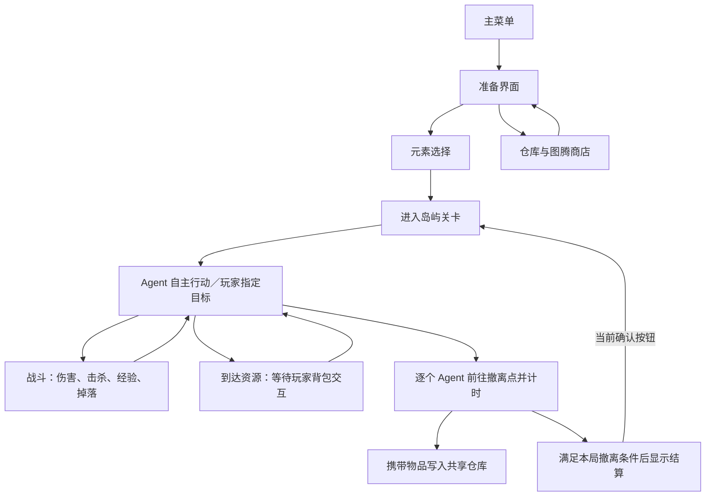

# Anomaly Search

**Anomaly Search** 是 Shine Muscat 团队在 CUC211-AU Interaction Design 中制作的 Unity 游戏项目，工程名为 `Extraction-like`。作品围绕多角色自主行动与搜刮撤离展开：Agent 在岛屿场景中寻找资源、遭遇敌人并执行战斗，玩家通过切换关注角色、指定目标、处理背包和选择成长方向影响局势，最终尝试将战利品带出局。

当前工程已包含双 Agent 主玩法场景、冰／土战斗流派、多种敌人与 Boss、搜刮背包、装备与天赋、撤离结算，以及独立的仓库和图腾商店。场景、美术、音效与制作工具已有较大规模的集成；元素选择到出战阵容、局外配装到再次出战等环节仍需补齐。

## 作品完成情况

| 内容 | 当前完成情况 | 实际范围 |
| --- | --- | --- |
| 菜单与准备界面 | 已接入主要页面与跳转 | 主菜单、准备界面、元素选择、商店；设置和强化入口仍为占位 |
| 岛屿关卡 | 已有集成场景与区域内容 | 包含资源、敌人来源、Boss、撤离点、建筑遮挡与区域连接；保留多份制作和测试场景 |
| 多角色行动 | 已接入主场景 | 两个 Agent 独立行动，支持焦点切换、指定目标、镜头与背包跟随焦点 |
| Agent 自主行为 | 已接入发现、指令生命周期与执行链 | 受击反击后恢复撤离、导航失败释放任务、成员级目标选择；风险评分模块已实现，基础预制体默认关闭 |
| 战斗与敌人 | 已有配置、预制体和运行时行为 | 冰／土两套 Agent 流派、四类特色普通敌人、Hunter Boss，以及基础近战／远程敌人 |
| 搜刮与背包 | 已接入局内交互 | 固定背包、物品搜索、拖拽、堆叠、快捷转移、整理、装备槽和角色库存切换 |
| 成长系统 | 已接入经验与天赋 | 击杀／开箱经验、等级、天赋点、冰／土天赋效果、图腾属性修正 |
| 撤离结算 | 已实现局内到仓库的数据链 | 按 Agent 计时撤离、结算携带物品、展示时间／数量／价值；确认后目前重开本关 |
| 仓库与商店 | 已有独立 UI 和本地持久化 | 分页仓库、出售物品、购买图腾、金币记录、按真实时间刷新商店库存 |
| 画面与反馈 | 已有美术资源及多处玩法接入 | 角色与敌人动画、技能 VFX、HUD、顶部指令结果淡入淡出、音效、Toon 描边和墙体淡出 |
| 自动回归 | 已有隔离运行与运行证据 | 75 个构造用例，覆盖任务/导航/感知/交战/评分/装备；由编码 Agent 启动真实 Play Mode 并读取结果 |
| 内容生产 | 已有编辑器工具链 | 物品导表、预制体生成、敌人配置、白盒搭建、NavMesh、UI 构建与资源散布 |

## 打开与体验

### 环境

| 项目 | 版本／要求 |
| --- | --- |
| Unity Editor | `2022.3.62f2c1`，见 [ProjectVersion.txt](ProjectSettings/ProjectVersion.txt) |
| Universal Render Pipeline | `14.0.12` |
| AI Navigation | `1.1.7` |
| ProBuilder | `5.2.4` |
| UI | UGUI、TextMesh Pro；当前使用旧输入系统 |
| 大型资源 | 仓库通过 Git LFS 管理部分模型、贴图、音频和字体，规则见 [.gitattributes](.gitattributes) |

1. 获取仓库后，确保 Git LFS 资源已下载；已有检出目录可执行 `git lfs pull`。
2. 在 Unity Hub 中添加工程，使用上述编辑器版本打开，等待资源导入与脚本编译结束。包依赖记录在 [manifest.json](Packages/manifest.json)。
3. 打开 [Scene_MainMenu](Assets/Scenes/Scene_MainMenu.unity) 后进入 Play Mode，体验菜单到关卡的流程。
4. 直接验证局内玩法时，可打开 [Scene_lyl_test2 1](Assets/Scenes/Scene_lyl_test2%201.unity)。该场景是当前元素选择页面指向的关卡。
5. 构建时以 [EditorBuildSettings.asset](ProjectSettings/EditorBuildSettings.asset) 为准，主菜单目前位于构建列表首位。

Node 脚本属于可选的内容制作工具，运行现有 Unity 场景不需要先执行它们。

### 场景入口

| 场景 | 用途与连接情况 |
| --- | --- |
| [Scene_MainMenu](Assets/Scenes/Scene_MainMenu.unity) | 当前主入口，开始游戏后进入准备界面 |
| [Scene_PreparationInterface](Assets/Scenes/Scene_PreparationInterface.unity) | 进入商店或元素选择 |
| [Scene_ElementSelectionMenu](Assets/Scenes/Scene_ElementSelectionMenu.unity) | 五种元素中选择两个，随后载入主玩法场景；阵容接线状态见下文 |
| [Scene_lyl_test2 1](Assets/Scenes/Scene_lyl_test2%201.unity) | 当前菜单流程使用的 3D Raid 集成场景，预置冰、土两个 Agent |
| [ShopCanvasTest](Assets/Scenes/ShopCanvasTest.unity) | 当前准备界面使用的商店场景，包含仓库、交易和返回按钮 |
| [StorageCanvasTest](Assets/Scenes/StorageCanvasTest.unity) | 独立仓库验证场景，未列入当前构建列表 |
| [Scene_StartMenu](Assets/Scenes/Scene_StartMenu.unity)、[Scene_sdw_test2](Assets/Scenes/Scene_sdw_test2.unity) | 保留的另一条启动与集成测试路径 |
| [Scene_lyl_IslandWhitebox](Assets/Scenes/Scene_lyl_IslandWhitebox.unity)、[RenderTest](Assets/Scenes/RenderTest.unity) | 白盒内容生产与渲染验证入口 |
| `Assets/Scenes/Scene_DB`、`Scene_ZL` 及其他测试场景 | 关卡制作与联调版本；文件名中的 Final 不等同于当前菜单入口 |
| `Assets/Scenes/Obsolete` | 历史场景，配合旧原型代码阅读 |

### 常用操作

以下按当前脚本默认绑定整理，场景中的 Inspector 覆盖值优先。

| 操作 | 效果 |
| --- | --- |
| 鼠标左键点击目标群 | 给当前焦点 Agent 指定资源、敌人或撤离目标 |
| `Tab` | 切换焦点 Agent；背包打开时不切换 |
| `F` | 与附近对象交互；无交互目标时打开背包，背包已打开时关闭 |
| `I` | 开关背包 |
| 拖拽物品 | 调整占格位置、转移物品或放入匹配的装备槽 |
| `Ctrl` + 左键点击物品 | 在可用容器之间快捷转移 |
| `P` / `Esc` | 打开或关闭天赋面板 / 关闭天赋面板 |
| `M` | 切换完整地图显示 |
| 结算／失败后按 `R` | 重新开始当前场景 |

Agent 的移动和常规战斗由 AI 驱动。背包与商店内的物品操作、天赋选择通过对应 UI 完成。

## Gameplay 规则与链路

### 一局游戏如何推进



当前已实现“局内携带物品 → 撤离 → 仓库持久化”。仓库配装进入下一局、结算返回准备界面等产品闭环尚未全部接通。

### 多 Agent 与目标干预

- 当前主场景预置两个 Agent；每个角色拥有独立生命、战斗、成长和局内背包状态。
- 玩家每次关注一个角色，焦点切换会影响镜头、交互对象、背包和角色信息展示。
- 场景目标按“区域 → 目标群 → 具体实体”组织。资源群包含箱子／物品，敌人来源群包含生成配置，活跃敌人群追踪存活敌人，撤离群绑定撤离点。
- 默认自动发现比较可执行敌人与可达资源的具体成员距离，保持资源时采用同一口径；没有普通候选时寻找可达撤离点，包括感知范围外的后备点。
- 手动资源任务不会被单纯发现敌人覆盖，但有效敌人伤害可中断并反击；零伤害或完全被护盾吸收不打断。
- 撤离受有效伤害后暂停，反击结束继续原撤离目标与原指令。连续受击只保留一份恢复记录，新手动命令、取消或死亡清理旧记录。
- 指令接受前检查目标有效性和执行条件；导航丢失、动态断路或持续无进展会终止任务并释放锁。画面顶部显示“指令下达成功”或“指令下达失败：具体原因”，暂停时仍会淡入淡出。
- 风险评分模块读取实际防御、所有唯一可见风险敌人和具体成员位置，支持当前目标奖励与低血量撤离倾向；基础 Agent 预制体默认未启用该模块。

### 搜刮、背包与装备

资源的“到达”“搜索完成”和“取空”是不同阶段。Agent 到达可交互位置后，会等待玩家打开背包处理物品；关闭界面后写回资源状态。采用资源点规则的箱子需要结合剩余物品继续判断完成状态，普通资源另有一次背包开关后的确认逻辑。

外部位移会重新检查交互距离，并使旧的“已到达／已打开背包”记录失效。角色被移远后关闭界面不能完成该资源，需要返回后重新进行有效交互。

- 标准背包为 **5 列 × 6 行**，装备位为头部、身体、面部、耳机及两个图腾槽。
- 物品具有尺寸、数量、品质、售价和搜索状态，支持格子占用、放置预览、自动旋转适配、堆叠、快捷转移和整理；底层还保留容器与拆分能力。
- 背包打开会暂停游戏时间，物品搜索使用不受暂停影响的时间继续推进。此时其他 Agent 与敌人的基于游戏时间的行动也暂停。
- 切换焦点时保存和恢复对应角色的库存快照；场景资源的剩余内容由资源对象共享维护。
- 本局收益显示与撤离结算以实际携带物品为依据。取出物品、装备图腾和整理背包会影响最终带出的内容。

### 战斗、成长与敌人

Agent 在合法射程和视线内优先尝试就绪技能，再执行普通攻击；能原地射击时不要求走到敌人脚下。双方远程允许跨高低差，但仍受三维射程、发射点射线和墙体约束，飞行中的弹体遇实体停止。攻击组件或弹体配置不可用会明确失败。

流派配置定义攻击与技能，天赋和图腾进一步修正属性；属性刷新和装备图腾保留已有技能冷却，状态切换不重置普攻间隔。当前正式配置集中在冰、土两种流派：冰系 `FrostAssault`、`Winterfall`，土系 `StoneWall`、`QuakeField`。

击杀敌人与打开不同档位的资源箱可以获得经验；经验来源设有累计上限。升级提供天赋点，天赋支持属性成长、技能强化、护盾、经验加成和击杀收益等效果。角色实际数值由 Pawn、流派、天赋、图腾和场景覆盖共同决定。

| 敌人内容 | 已有行为与攻击特色 |
| --- | --- |
| 基础近战／远程敌人 | 巡逻、发现、追击、近战或投射物攻击 |
| Modern Strander | 触手接触与吸附、腐蚀、拉扯、直接受击反应 |
| Tidal Aberration | 近战电击、水流攻击与击退；部分附加效果仍依赖旧玩家能力 |
| Ancient Strander | 鱼骨横扫、咬击及独立攻击冷却 |
| Anchor Sentinel | 范围发现、锁定、持续光束、冷却；当前版本已采用直接受伤规则 |
| Hunter Boss | 近战、漩涡、抛锚、低血量咆哮、护盾与元素状态交互 |

敌人还具备随机／固定路线巡逻、视野与遮挡检测、怀疑刺激、调查搜索、生命条和追击提示。具体启用能力取决于敌人配置。死亡结果会同步到目标群、击杀统计、攻击者成长与死亡掉落。

巡逻会扫描全部有效角色候选，最近角色被遮挡时仍能发现其他可见角色。当前目标死亡、禁用、销毁或撤离后，敌人整体更新目标和伤害／位移接收器，避免攻击留在旧角色上。

### 撤离、仓库与经济

- 撤离按 Agent 分别计时；成功撤离后收集其背包内容与六个装备槽的可结算物品，并写入共享仓库。
- 容器内容会递归提取，背包／胸挂等容器本身不作为普通战利品结算。死亡角色的可结算库存会被丢弃。
- 成功条件检查本局要求撤离的角色集合；击杀数和拾取数用于统计，当前完成判定没有要求清空全图敌人。
- 仓库每页 **6 列 × 10 行**，默认至少十页，并可按需要扩展；支持分页和当前页整理。
- 图腾商店使用 **4 × 4** 商品格，支持购买、售罄、金币显示、仓库物品出售和刷新倒计时。
- 商品库存按真实 UTC 时间每 **30 分钟** 刷新，与局内暂停时间无关。
- 当前有生命、狙击、冰霜、地鸣、进击、轻盈六类图腾，每类绿／蓝／金三档，共 **18 个图腾条目**。部分高品质图腾包含属性取舍。

仓库、经济与商店数据以文件形式保存在 `Application.persistentDataPath`：

| 文件／存储项 | 内容 |
| --- | --- |
| `player_storage.json` | 仓库页面、物品 ID、数量与位置 |
| `player_economy.json` | 金币记录 |
| `totem_shop_stock.json` | 商店库存、售罄状态与下次刷新时间 |

元素选择另存于 PlayerPrefs 的 `ElementSelectionMenu.SelectedElements` 键，当前尚未发现出战读取链路。

仓库通过稳定 `ItemID` 在运行时物品数据库中恢复物品。局内背包、生命、经验和天赋目前不构成完整的对局中途存档。

## 资产与内容现状

### 主要资源位置

| 类别 | 已有资源与接入情况 | 位置 |
| --- | --- | --- |
| Agent | 共用实体预制体、冰／土 Pawn 配置、普通攻击与技能表现 | [PlayerPrefab](Assets/Prefabs/PlayerPrefab)、[Agent SO](Assets/SO/Agent)、[战斗资源](Assets/Resources/Agent) |
| 敌人 | 基础敌人、四类特色敌人、Boss、出生点、七份敌人配置 | [Enemy Prefabs](Assets/Prefabs/Enemy)、[Enemy SO](Assets/SO/Enemies) |
| 地图与建筑 | 岛屿、建筑、房间、场景道具、区域和目标群预制体 | [Models](Assets/Art/Models)、[Island](Assets/Prefabs/Island)、[Rooms](Assets/Prefabs/Rooms)、[Cluster](Assets/Prefabs/Cluster) |
| 动画 | 角色与敌人动作、Animator Controller、七份 Override Controller，以及动画适配脚本 | [Animations](Assets/Art/Animations)、[Animation Controllers](Assets/Art/Animation%20Controllers) |
| 技能 VFX | 玩家元素攻击、触手腐蚀、电击／水流、鱼骨、光束、锚与漩涡等脚本／预制体 | [VFX](Assets/Art/VFX)、[Agent Skill VFX](Assets/Prefabs/Agent/Combat/VFX) |
| UI 与图标 | 菜单、元素选择、背包、商店、物品、图腾、HUD、天赋和结算资源 | [Sprites](Assets/Art/Sprites)、[UI Prefabs](Assets/Prefabs/UI)、[HUD](Assets/Resources/HUD)、[结算 UI](Assets/Resources/UI) |
| 搜刮物品 | 当前 TSV 有 42 条启用记录、25 列；包含 15 条普通物品和 27 条装备记录，装备中含 18 条图腾 | [Loot 配置表](Assets/Config/Loot)、[ItemData](Assets/SO/ItemData)、[世界拾取物](Assets/Prefabs/ItemPrefabIn3D) |
| 音频 | BGM、攻击、技能、搜索、背包开关、UI、死亡、升级与撤离反馈；部分音效保留不同格式版本 | [GameAudio](Assets/Resources/GameAudio) |
| 渲染 | Toon 材质与描边、Sobel、像素抖动、FFT 海面、草地 Shader；具体效果按 Renderer 和场景启用 | [Shader](Assets/Shader)、[Renderer](Assets/Scripts/Renderer)、[Settings](Assets/Settings) |
| 第三方资源 | 自然环境资源包、TextMesh Pro 示例与配套内容 | [ThirdParty](Assets/ThirdParty) |

### 文件规模

下表为当前目录文件盘点，排除 `.meta`；文件数包含复用、生成资产和历史内容，不等同于独立内容数量或全部已投入主场景的数量。

| 目录 | 当前规模 |
| --- | --- |
| `Assets/Art` | 83 个 FBX 文件、232 张 PNG／JPG／JPEG 图片、18 个 `.anim`、2 个 Controller、7 个 Override Controller |
| `Assets/Prefabs` | 127 个预制体，另有 HUD／结算预制体位于 `Resources`；`Resources/HUD` 当前含 2 个预制体，包括新增指令反馈 |
| `Assets/SO` | 70 份 `.asset`：52 份物品、7 份敌人、3 份 Agent、1 份 MapGraph、7 份旧 BoardGame 配置 |
| `Assets/Scenes` | 35 个场景，其中 9 个位于 `Obsolete`；当前构建列表启用 8 个场景 |
| `Assets/Resources/GameAudio` | 23 个音频文件，包含不同格式版本 |
| `Assets/Scripts` | 407 个 C# 文件，其中 58 个位于顶层 `Editor`、63 个位于 `Obsolete` |

第三方目录另外包含 29 个示例场景和 233 个预制体，上表未将它们计入项目场景／预制体数量。美术目录中也存在白盒、生成与演示资源；当前画面以主场景及其预制体绑定为准。

## 已有制作与验证流程

### 物品表 → 数据与拾取物

1. 在 [LootItems_Template.xlsx](Assets/Config/Loot/LootItems_Template.xlsx) 或 [LootItems.tsv](Assets/Config/Loot/LootItems.tsv) 中维护物品数据，保持 `ItemID` 稳定。
2. 使用 Unity 菜单 `Tools/Backpack/Import Loot Items From TSV`，先校验整表，再执行导入。
3. 导入器按 ID 创建／更新 `Assets/SO/ItemData/Table` 下的数据，并生成或修复 `Assets/Prefabs/ItemPrefabIn3D` 下的世界拾取物；已有美术表现与非默认图标会尽量保留。
4. 在箱子／场景资源规则中配置掉落，并核对运行时物品数据库与商店池是否收录。导入器不负责自动生成箱子内容配置。
5. 在场景中验证搜索、拖拽、装备、售价和撤离恢复。

`tools/` 保留工作簿构建、TSV 导出、工作簿校验与图腾资产生成脚本。其中工作簿相关脚本依赖 `@oai/artifact-tool`，使用前需单独准备 Node 环境和依赖。

### 敌人／资源配置 → 场景接入

- 敌人：配置 `Assets/SO/Enemies` → 绑定敌人 Pawn 预制体 → 配置出生点或场景实例 → 加入来源群／活跃敌人群 → 设置危险档位与巡逻路线 → 验证感知、攻击、死亡和掉落。
- 资源：配置物品与箱子 → 加入资源群 → 设置资源档位 → 核对碰撞体和可达交互位置 → 验证开箱、搜索、取物及群完成状态。
- 撤离：配置撤离点、撤离群及计时 → 验证单角色和多角色进入／离开 → 核对结算物品与仓库数据。
- 导航：使用已有 NavMesh Surface 与 `Tools/NavMesh/Scene NavMesh Align Tool` 核对场景导航，重点检查建筑、资源交互点与跨区域连接。

### 表现与场景制作工具

| 入口 | 作用 |
| --- | --- |
| `Tools/Agent/Combat/Generate Default Combat Content` | 生成默认 Agent 战斗配置与配套资源 |
| `Tools/Enemies/Create Runtime Enemy Config Assets` | 创建／迁移敌人配置资源 |
| `Tools/Backpack/Rebuild Storage Canvas`、`Rebuild Totem Shop Canvas` | 构建仓库与商店 UI |
| `Tools/UI/Rebuild … Scene` | 构建菜单、准备界面和元素选择场景 |
| `Tools/Whitebox/…` | 搭建岛屿、建筑、战斗区、撤离区、传送点及按标记填充内容 |
| `Tools/Rendering/Toon Outlines/Bake Smooth Normals …` | 为 Toon 外扩描边生成平滑法线网格 |
| `Tools/Map Graph/…` | 转换旧地图定义并创建图地图 UI 预制体 |

这些工具中有一部分面向固定的制作／测试场景，会生成或重建资产；执行时应先核对工具指定的场景与输出目录。旧魔法知识散布工具的入口和适用场景见 [MagicKnowledgeScatterGuide](Assets/Docs/MagicKnowledgeScatterGuide.md)。

### 联调与验收

当前已有项目自有 NUnit／UnityTest 构造回归，运行器在隔离副本中自动进入真实 Play Mode、运行导航和物理、保存逐例轨迹及正式 HUD 截图。编码 Agent 负责执行和定位，使用方法见 [自动回归说明](tools/agent-repro/README.md)，实际结果见 [修复验收报告](outputs/implementation_validation_report.md)。这些用例覆盖目标、执行与交战的已确认规则，不等于整个产品体验都已自动验收。

2026-09-11 最终矩阵：**75 例 × 3 轮，225/225 通过**；另有 7 个报告层故障构造通过。顶部指令提示已保存 [成功](outputs/feedback/success.png)及 [失败原因](outputs/feedback/failure.png)的正式 prefab 渲染证据。

内容与关卡改动仍可按以下顺序进行整体验收：

1. 菜单进入关卡、两个 Agent 注册、焦点切换与镜头跟随。
2. 指定资源／敌人／撤离目标，检查角色能否到达并执行对应行为。
3. 搜索、背包暂停与恢复、物品转移、装备和角色库存切换。
4. 战斗伤害、特殊效果、击杀经验、天赋和死亡掉落。
5. 撤离计时、物品入库、结算界面与重开；另行覆盖部分死亡等混合结局。
6. 商店出售、购买、金币变化、库存刷新，以及重新进入场景后的数据恢复。

## 尚待接通与整理的部分

| 项目 | 当前边界 |
| --- | --- |
| 元素选择影响阵容 | UI 保存了两个元素，但尚未发现读取结果并生成／配置出战 Agent 的链路；主场景仍预置冰、土角色 |
| 五元素完整内容 | 菜单已有五种元素，正式 Agent 流派与天赋内容主要为冰、土 |
| 局外到再次出战 | 仓库、交易和撤离入库已有实现；完整出战配装恢复、结算返回准备界面仍待接通 |
| 设置与强化页面 | 当前按钮保留入口，具体界面与流程未实现，天赋树面板尚未完成 |
| 新旧玩家能力 | 部分沉默、减益和魔法知识拾取仍依赖旧 Player 脚本，需要核对其对当前 Agent 的实际效果 |
| 多角色混合结局 | 撤离所需角色集合与死亡处理需要补充联合验收，尤其是一人死亡、另一人撤离的分支 |
| 场景与资源收敛 | 存在多份测试／制作场景、旧桌游内容及生成资源；当前主入口以菜单绑定和 Build Settings 为准 |

旧桌游原型验证过四 AI 在点线地图上的自主行动、共享战斗和资源交互，其代码保留于 `Assets/Scripts/Obsolete/BoardGame`。新的 `Gameplay/MapGraph` 提供图地图和 3D Agent 状态投影能力，目前主场景未绑定其 Overlay。两者可作为历史与扩展参考，不应直接套用为当前主关卡规则。

## 工程导航与文档

```text
Assets/
├─ Art/             模型、贴图、动画、VFX 与生成美术
├─ Config/Loot/     物品工作簿与 TSV
├─ Docs/            系统设计和制作说明
├─ Font/            字体与字体资源
├─ Prefabs/         角色、敌人、目标群、建筑与 UI
├─ Resources/       运行时加载的配置、数据库、HUD、音频与结算资源
├─ Scenes/          主流程、制作、测试及历史场景
├─ Scripts/
│  ├─ Core/         通用行为树、黑板与分层状态机
│  ├─ Gameplay/     Agent、Targets、Enemy、Backpack、Raid 等玩法
│  ├─ Editor/       内容制作工具与 AgentReproduction 自动运行态测试
│  ├─ Renderer/     海面、描边与后处理
│  ├─ Audio/        音频播放入口
│  └─ Obsolete/     历史桌游原型
├─ Settings/        渲染管线与其他项目配置资源
├─ Shader/          项目 Shader 与 HLSL
├─ SO/              角色、敌人、物品与地图数据
└─ ThirdParty/      第三方资源和示例
tools/              内容辅助脚本与 agent-repro 隔离回归运行器
ProjectSettings/    Unity 工程与构建设置
Packages/           包依赖
```

- [Gameplay Agent 框架设计](Assets/Docs/GameplayAgentFrameworkDesign.md)：身份、指令、行为树与跨系统交互。
- [敌人系统概览](Assets/Docs/EnemySystemOverview.md)：生成、目标群、巡逻、感知和敌人配置。
- [修复验收报告](outputs/implementation_validation_report.md)：F1–F7 / R1–R5 实现、构造证据、重复结果和覆盖边界。
- [URP Toon 描边说明](Assets/Docs/Rendering/URPToonOutlineSystem.md)：网格处理、材质与 Renderer 配置。
- [魔法知识散布指南](Assets/Docs/MagicKnowledgeScatterGuide.md)：旧知识拾取物的生成与场景散布。
- [旧桌游原型说明](Assets/Scripts/Obsolete/BoardGame/README.md)：早期玩法验证规则和资源组织。
- [task_plan.md](task_plan.md)、[progress.md](progress.md)、[findings.md](findings.md)、[.planning](.planning)：历史规划、实现记录与问题调查。

历史文档包含旧路径和旧玩法描述；判断当前作品行为时，应同时核对实际入口场景、预制体、SO 配置和脚本调用。
