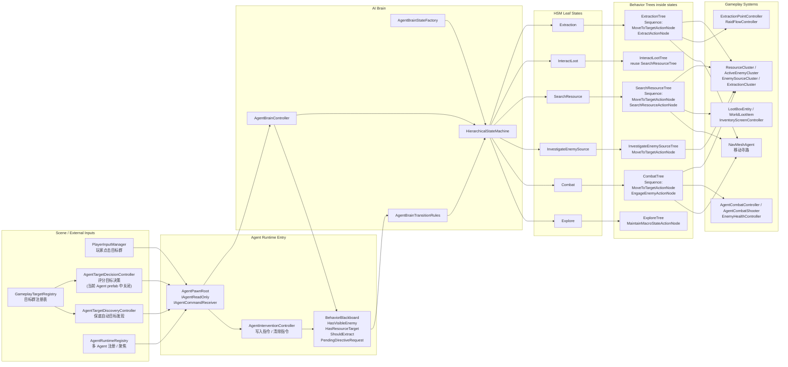
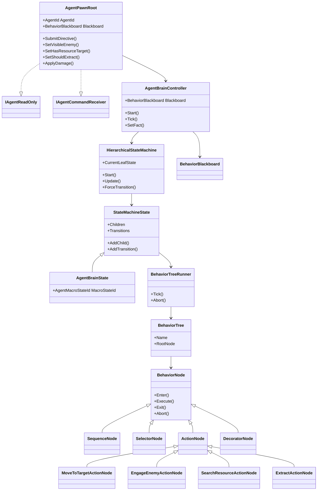
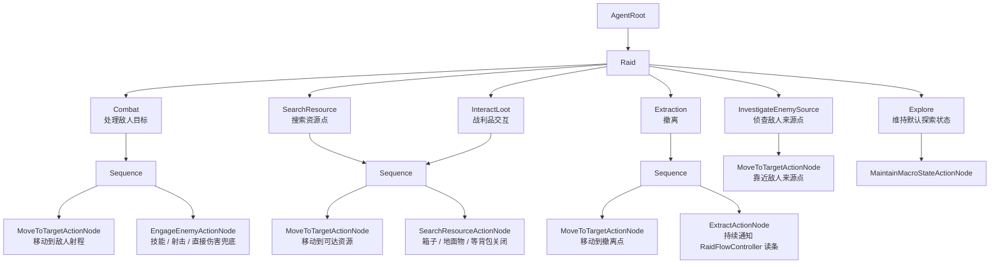

# Agent AI Framework Diagram

这张图按当前真实代码结构整理，不是理想化设计稿。核心链路是：

`AgentPawnRoot -> AgentBrainController -> HierarchicalStateMachine -> AgentBrainState -> BehaviorTreeRunner -> Agent Action Nodes -> Gameplay Systems`

## Overall Architecture

## Class Relationship

## HSM + Behavior Tree Mapping

