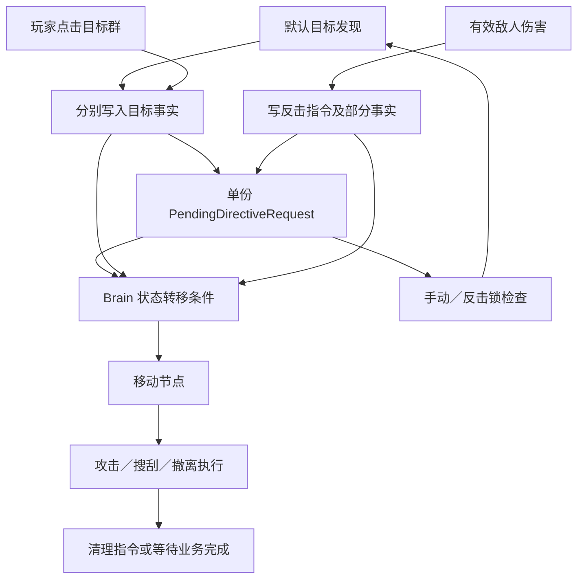

# Anomaly Search：目标选择、Agent 执行与交战逻辑审查

- 审查日期：2026-09-10
- 代码基线：`810c99d1224f7166f325d3e985e27929f0fe26c6`
- 范围：目标发现／手动选择、指令锁、Brain 状态转移、移动／搜刮／撤离执行、Agent 攻击、敌人选人和目标失效处理。
- 方法：静态调用链检查、状态条件推演、预制体与配置核对。**本次未执行 Unity Play Mode、物理碰撞或实际关卡复现。**下文“代码确认”表示给定前提后能从代码推出结果，不表示已经在游戏中观察到。
- 本次产物仅为审查文档，未修改玩法代码、场景或配置。修复建议是供讨论的职责归属与方向，不是已确认的实现方案。
- 后续规划：[自动复现、修复与回归实施规划](../.planning/2026-09-11-agent-reproduction/task_plan.md)；[具体生产文件与修复架构](../.planning/2026-09-11-agent-reproduction/repair_design.md)（2026-09-11，玩法规则已确认，新增架构待 Review，尚未实施）。

> **2026-09-11 用户 Review 更新**：F1 采用“受击反击后恢复原撤离”；F3 明确允许伤害打断，原先将覆盖本身判为 Bug 的结论相应纠正。F2／F4／F6／F7 明确修复；F5 与 R1 合并修复并增加顶部成功／带原因失败提示；R2／R3 合并加入范围、射线、墙体约束，同时允许双方远程跨高低差索敌；R4／R5 明确修复。下面保留代码证据，当前行为契约以更新后的实施规划为准。编码 Agent 负责构造、启动 Play Mode、定位、修复和重跑，用户不承担手工验证。

## 1. 结论与优先级

原始审查列出 **7 项有明确代码依据的发现**和 **5 组场景风险**。本次 Review 后，F3 的覆盖行为按预期保留并统一打断语义，其余项目纳入明确修复范围；编号保持，便于关联证据与回归。优先处理撤离受击状态冲突，以及部分敌人在 Agent 死亡后无法正确换目标的问题。

严重程度：P1 表示会破坏主要流程或多 Agent 交战；P2 表示特定条件下的错误行为、控制失效或数值异常。排序也考虑当前主流程的接入情况。

| 编号 | 优先级 | 问题 | 证据状态 |
| --- | --- | --- | --- |
| F1 | P1 | 撤离受击后保留 `ShouldExtract`，导致 Combat／Extraction 反复切换 | 代码确认 |
| F2 | P1 | Ranged、Anchor Sentinel、Hunter Boss 对死亡目标的失效处理不完整 | 代码确认；各敌人表现不同 |
| F3 | P2 | 受击覆盖手动资源指令与旧保护语义不一致 | 覆盖事实成立；用户确认允许伤害打断，须统一规则和回归 |
| F4 | P2 | 新选资源与保持资源使用不同距离，导致敌人／资源来回切换 | 代码确认；需要对应空间布局 |
| F5 | P2 | 不可达的手动目标没有失败释放路径，可长期锁住自主选择 | 代码确认；需要不可达目标 |
| F6 | P2 | 敌人巡逻感知长期只检查缓存的一个 Agent，可能忽略另一个可见 Agent | 代码确认；双 Agent 场景可触发 |
| F7 | P2 | 图腾属性变化重建技能实例，清空技能冷却 | 代码确认；需要局内换装 |

## 2. 当前实际执行链

当前菜单指向的主玩法场景仍使用 [Agent.prefab](../Assets/Prefabs/PlayerPrefab/Agent.prefab#L308)；基础预制体的 `_enableDecisionModule` 为 `0`，主入口场景未覆盖该字段。因此主流程优先审查 `AgentTargetDiscoveryController`，评分式 Decision 模块单列为扩展路径风险。

这条链目前依靠多个调用点维持一致性：**指令、目标事实、宏状态和行为树内部状态没有统一的切换事务。**最明显的问题来自指令已经换成 Engage，而旧的撤离／资源事实仍然保留；另一些问题来自目标失败后，执行层没有向指令层反馈“本次任务无法继续”。

## 3. 有明确代码依据的问题

### F1 · P1：撤离途中受击会造成 Combat／Extraction 状态振荡

**触发条件**：Agent 正在执行撤离，`ShouldExtract=true`；被可解析到 `EnemyHealthController` 的敌人造成实际伤害；敌人没有立即死亡。

**代码依据**：

- [AgentPawnRoot.RecordCombatDamageInterrupt，449–470 行](../Assets/Scripts/Gameplay/Agent/Core/AgentPawnRoot.cs#L449)：写入反击 Engage 指令、`HasVisibleEnemy=true`，但没有清除 `ShouldExtract`。
- [CanEnterExtraction，132–137 行](../Assets/Scripts/Gameplay/Agent/AI/Factories/AgentBrainTransitionRules.cs#L132)：只要求未死亡且 `ShouldExtract=true`。
- [CanExtractionBeInterruptedByCombat，210–218 行](../Assets/Scripts/Gameplay/Agent/AI/Factories/AgentBrainTransitionRules.cs#L210)：只要求未死亡且 `HasVisibleEnemy=true`，手动资源保护之外没有排他约束。
- [状态机装配，89–93 行及 189–193 行](../Assets/Scripts/Gameplay/Agent/AI/Factories/AgentBrainStateMachineFactory.cs#L89)：两条转移同时存在。
- [MoveToTargetActionNode，45–46 行](../Assets/Scripts/Gameplay/Agent/AI/Actions/MoveToTargetActionNode.cs#L45)：撤离行为树收到 Engage 时只返回指令不匹配，不修正上述事实。

**逐 Tick 推演**：

| 时刻 | 指令 | VisibleEnemy | ShouldExtract | 结果 |
| --- | --- | --- | --- | --- |
| 受击前 | Extract | false | true | 正常撤离 |
| 受击写入后 | Engage | true | true | 留下冲突事实 |
| 下一次 Brain Tick | Engage | true | true | Extraction → Combat |
| 再下一次 Tick | Engage | true | true | Combat → Extraction；撤离节点缺少 Extract 指令 |
| 后续 Tick | Engage | true | true | 重复上述两次转移，直到外部条件改变 |

反击锁还会阻止自动发现层刷新目标，使它难以自行纠正。敌人在射程内时，频繁重进攻击节点还会反复执行 [OnEnter 的 `_nextAttackTime=0`，28–30 行](../Assets/Scripts/Gameplay/Agent/AI/Actions/EngageEnemyActionNode.cs#L28)，可能使普通攻击间隔失真。这里重置的是执行节点节奏，技能本身的冷却仍由技能实例维护。

**验证方法**：双 Agent 场景中，给其中一个下达撤离指令；由高血量敌人在其撤离途中造成一次伤害。观察连续帧的宏状态、PendingDirective、`ShouldExtract` 和 `HasVisibleEnemy`，并检查是否反复出现缺失 Extract 指令。

**修复方向／归属（已更新）**：受击中断撤离反击，结束后恢复原撤离任务。Pawn 转发事件，指令生命周期保存／恢复原请求并同步活动事实；`AgentBrainTransitionRules` 不允许两个互斥任务同时持续成立。新手动命令或死亡取消旧恢复记录，详见修复设计。

### F2 · P1：部分敌人不会在当前 Agent 死亡后重新选择存活 Agent

**触发条件**：存在两个存活 Agent；敌人已绑定 A；A 死亡但 B 仍存活。当前 [AgentPawnRoot.HandleDeath，703–720 行](../Assets/Scripts/Gameplay/Agent/Core/AgentPawnRoot.cs#L703) 和 [RaidFlowController.NotifyAgentDied，136 行起](../Assets/Scripts/Gameplay/Raid/RaidFlowController.cs#L136) 不销毁死亡 Pawn，因此 A 的 `Transform` 仍然非空。

| 敌人 | 代码路径 | 结果 |
| --- | --- | --- |
| Ranged | [EnsurePlayerTransform / AssignCombatTarget，636–672 行](../Assets/Scripts/Gameplay/Enemy/RangedEnemyBehaviorController.cs#L636)：伤害接收器查找失败后仍返回 `true` | 旧 Transform 被视为可用，不进入重新查询；继续围绕尸体追击／瞄准／发射 |
| Anchor Sentinel | [EnsurePlayerReferences，439–458 行](../Assets/Scripts/Gameplay/Enemy/AnchorSentinelBehaviorController.cs#L439)：仅在 Transform 为空时选人；旧接收器死亡后返回 `false` | [Update，116–119 行](../Assets/Scripts/Gameplay/Enemy/AnchorSentinelBehaviorController.cs#L116) 持续提前返回，没有重新选择 B 的步骤 |
| Hunter Boss | [EnsurePlayerReferences，1242–1272 行](../Assets/Scripts/Gameplay/Enemy/HunterBossBehaviorController.cs#L1242)：只检查 Transform 和缓存接收器非空，不检查存活 | 继续以 A 的位置执行状态机；部分攻击最终因死亡接收器拒收而没有有效伤害 |

Boss 还存在同类缓存风险：A 撤离销毁后可以重新取得 B 的 Transform，但 `_combatDamageReceiver` 没有随目标身份变化强制重绑；不能保证瞄准对象与实际伤害接收对象一致。该销毁分支需要额外做运行验证。

**验证方法**：分别测试上述三类敌人。让其先锁定 A，再让 A 死亡并保持 B 在有效发现范围内，确认敌人是否主动转向 B。另测 A 撤离后 Boss 对 B 的近战／咆哮伤害接收对象。

**修复方向／归属**：在对应敌人控制器的引用维护入口处理目标死亡、销毁和身份变化；复用 `PlayerTargetResolver` 查询存活 Agent，并整体刷新目标关联缓存。共享 [CombatDamageUtility，270–318 行](../Assets/Scripts/Gameplay/Enemy/EnemyHealthController.cs#L270) 已排除死亡接收器，问题不应通过放宽这个过滤来解决。

### F3 · P2：受击写入与旧手动资源保护语义不一致（允许打断已确认）

**触发条件**：玩家手动指定尚未完成的资源群，Agent 在走过去或等待交互时受到有效敌人伤害。

**代码依据**：

- [AgentManualDirectiveLock，14–17 行](../Assets/Scripts/Gameplay/Agent/Runtime/AgentManualDirectiveLock.cs#L14)：手动优先级为 `1000`，反击为 `900`。
- [CanResourceWorkBeInterruptedByCombatDamage，74–83 行](../Assets/Scripts/Gameplay/Agent/AI/Factories/AgentBrainTransitionRules.cs#L74)：明确为手动资源指令设置保护。
- [RecordCombatDamageInterrupt，449–470 行](../Assets/Scripts/Gameplay/Agent/Core/AgentPawnRoot.cs#L449)：没有检查当前手动指令，直接提交反击。
- [AgentInterventionController.SubmitDirective，29–39 行](../Assets/Scripts/Gameplay/Agent/Core/AgentInterventionController.cs#L29)：只有覆盖写入，没有优先级仲裁或原任务保存。

**影响**：状态机检查保护时，原手动 Search 已被替换成 Engage，所以 `HasManualResourceDirective` 为 false，保护条件失去作用。Agent 会放弃玩家指定资源，之后也没有原手动任务可供恢复。Priority 数值本身不会阻止这次覆盖。

**验证方法**：手动点选资源群，记下 `ManualTargetClick...` CommandId；被敌人命中一次，查看它是否变成 `CombatDamageInterrupt...`。测试应在背包关闭、游戏未暂停时进行。

**修复方向／归属（已更新）**：用户明确允许伤害打断手动资源任务，因此覆盖本身不是待修复错误。统一指令生命周期和状态转移：有效受击能反击，旧资源锁释放，未受击仅发现敌人仍保留手动任务；清理矛盾的保护注释和判断。仅撤离要求恢复原任务，资源反击结束后回到正常自主选择。

### F4 · P2：资源目标保持与首次选择的距离口径不同，会造成循环换目标

**触发条件**：默认发现模块工作；资源群有多个分散成员，最近成员比敌人近，但资源群中心比敌人远；期间没有手动锁或受击反击锁。

**代码依据**：

- [TryFindNearestResourceCluster，473–491 行](../Assets/Scripts/Gameplay/Agent/Runtime/AgentTargetDiscoveryController.cs#L473)：首次候选使用可达资源实体位置的距离。
- [TryKeepCurrentResourceClusterTarget，523–532 行](../Assets/Scripts/Gameplay/Agent/Runtime/AgentTargetDiscoveryController.cs#L523)：保持当前群时仅验证存在可达成员，随后改用群中心距离。
- [RefreshAgentTarget，211–234 行](../Assets/Scripts/Gameplay/Agent/Runtime/AgentTargetDiscoveryController.cs#L211)：将上述距离直接与最近敌人距离比较。

**可构造的例子**：最近可达箱子距离 2m，敌人距离 12m，资源群中心距离 20m，三者都在发现范围内。

1. 没有 Search 指令时：比较 2m 与 12m，选择资源。
2. 下次扫描保持 Search：比较 20m 与 12m，改选敌人。
3. 再次扫描时已不是 Search：重新比较 2m 与 12m，又选资源。

只要布局关系没有因移动或伤害改变，就会重复切换。当前冰／土 Pawn 配置的扫描间隔均为 0.5 秒，表现可能是转向、行走或动作每半秒被打断。

**验证方法**：设置上述布局，保持敌人暂不攻击，观察连续多次自动扫描的目标类型。资源群中心应由实际成员布局形成，不是只改 GameObject 名称或显示位置。

**修复方向／归属**：在 `AgentTargetDiscoveryController` 内统一新选与保持目标的距离定义；若需要目标保持奖励，应作为明确策略单独表达，不能通过更换测量位置隐式实现。

### F5 · P2：不可达手动任务可无限保持，缺少失败释放路径

**触发条件**：手动点选未完成的资源群／敌人／撤离点，但导航无法到达；或者接令后路径被阻断。

**代码依据**：

- [AgentActionNodeBase，382–419 行](../Assets/Scripts/Gameplay/Agent/AI/Actions/AgentActionNodeBase.cs#L382)：采样／完整路径计算失败时请求重建或停止移动，但 `hasReached` 仍为 false。
- [MoveToTargetActionNode，79–96 行](../Assets/Scripts/Gameplay/Agent/AI/Actions/MoveToTargetActionNode.cs#L79)：移动失败持续 Running；资源目标无法解析时返回 Failure，但没有清理指令。
- [SearchResourceActionNode，109–121 行](../Assets/Scripts/Gameplay/Agent/AI/Actions/SearchResourceActionNode.cs#L109)：资源群没完成又找不到可达成员时仍返回 Running。
- [AgentManualDirectiveLock，95–119 行](../Assets/Scripts/Gameplay/Agent/Runtime/AgentManualDirectiveLock.cs#L95)：主要依据完成状态，未处理任务失败、超时或不可达。
- [AgentTargetDiscoveryController，145–148 行](../Assets/Scripts/Gameplay/Agent/Runtime/AgentTargetDiscoveryController.cs#L145)：锁存在时跳过自动发现。

**影响**：未完成目标维持锁，执行又无法完成目标。没有后续玩家指令、可达性变化或其他外部打断时，Agent 可以长期停住。对不可达资源，自动发现原本有可达性过滤，因此这里尤其应验证手动输入路径，不能以自动候选过滤证明所有入口安全。

**验证方法**：把未完成资源放在与 Agent 完全断开的 NavMesh 岛上，手动选择该群；保持场景导航不变。观察其任务是否一直保留，是否有明确失败反馈，以及是否能回到其他可达任务。

**修复方向／归属（已更新）**：与 R1 合并，导航层区分等待、移动、到达和失败；指令层验证接受条件、处理失败并释放锁，展示顶部“指令下达成功／指令下达失败：原因”。不能把资源群伪造为完成。具体可配置预算、职责和 UI 文件已列入修复设计，远程可原地命中时不强制验证步行到敌人脚下。

### F6 · P2：巡逻感知只验证旧 Agent，遗漏另一名可见 Agent

**触发条件**：敌人初始化时选择 A；随后 A 仍存活但离开感知范围或被遮挡，B 进入敌人视野；B 尚未直接攻击该敌人。

**代码依据**：

- [PlayerTargetResolver，24–53 行](../Assets/Scripts/Gameplay/Enemy/Player/PlayerTargetResolver.cs#L24)：能查询最近的存活 Agent。
- [EnemyBehaviorController.EnsurePlayerReferences，605–623 行](../Assets/Scripts/Gameplay/Enemy/EnemyBehaviorController.cs#L605)：只要旧 A 仍能解析为伤害接收器，就返回成功，不重新比较候选。
- [CanSeePlayer，593–602 行](../Assets/Scripts/Gameplay/Enemy/EnemyBehaviorController.cs#L593)：视野检测只检查缓存的 `PlayerTransform`。
- Modern、Tidal、Ancient 和 Ranged 的引用维护存在相同的“旧目标可用就保留”结构。例如 [Modern，1137–1155 行](../Assets/Scripts/Gameplay/Enemy/ModernStranderBehaviorController.cs#L1137)、[Tidal，1160–1178 行](../Assets/Scripts/Gameplay/Enemy/TidalAberrationBehaviorController.cs#L1160)。

**影响**：处于 Patrol 的敌人可能继续认定“没有看见玩家”，即使 B 已经站到前方。B 直接攻击触发反击绑定后又可能恢复正常，因此简单的“射击后敌人会追我”测试不能覆盖这个问题。

这里针对的是**巡逻／重新感知阶段遗漏候选**，并不要求战斗中每帧切换到最近 Agent；保持已有战斗仇恨可以是合理规则。

**验证方法**：先让 A 成为缓存目标，然后把 A 移到视野外；让 B 从正面进入视野，禁止双方主动攻击，观察是否进入发现／追击状态。检查 `PlayerTransform` 是否仍为 A。

**修复方向／归属**：敌人感知阶段应有候选扫描，并对候选执行视野判断；战斗目标保持与巡逻感知应采用明确的不同条件。可复用运行时 Agent 查询，具体扫描调度与共同抽象需要在修复方案中确认。

### F7 · P2：图腾换装会把技能冷却重置为就绪

**触发条件**：Agent 已释放技能、冷却尚未结束；装备／卸下／更换会改变最终图腾修正值的图腾，然后恢复游戏。

**代码依据**：

- [AgentPawnRoot.RefreshEquippedTotemModifiers，603–629 行](../Assets/Scripts/Gameplay/Agent/Core/AgentPawnRoot.cs#L603)：修正值变化后调用 `AgentCombatController.ApplyConfig`。
- [ApplyConfig，85–101 行](../Assets/Scripts/Gameplay/Agent/Combat/Runtime/AgentCombatController.cs#L85)：图腾修正不同就重建运行时技能。
- [RebuildRuntimeSkills，180–202 行](../Assets/Scripts/Gameplay/Agent/Combat/Runtime/AgentCombatController.cs#L180)：清空原技能并创建新实例。
- [AgentCombatSkillBase，11、32–34、61 行](../Assets/Scripts/Gameplay/Agent/Combat/Runtime/AgentCombatSkillBase.cs#L11)：冷却存储在实例字段 `_nextReadyTime`；新实例默认是 0，没有恢复旧冷却。

**影响**：一次属性调整重置全部技能冷却，玩家可通过换装提前施法。背包暂停不会阻止这个问题；图腾修正会在恢复游戏后的刷新中生效。不会改变最终修正值的交换不触发这条路径。

**验证方法**：记录一个长冷却技能的施放时刻，在其冷却内更换有实际属性差异的图腾；关闭背包后观察该技能能否提前再次施放。与不换装对照。

**修复方向／归属**：`AgentCombatController` 应区分属性刷新与技能列表变化；属性刷新保留技能运行时状态。若确需重建，应按稳定技能身份迁移冷却，而不是让装备变化隐式刷新技能。

## 4. 需要运行验证或确认规则的风险

以下没有计入前面的 7 项问题，避免将场景条件、尚未启用的路径或玩法选择直接当成主场景已发生的 bug。

### R1：资源／撤离的到达容差为零

当前 [冰 Pawn 配置](../Assets/SO/Agent/SO_Agent__Ice_PawnConfig.asset#L19) 和 [土 Pawn 配置](../Assets/SO/Agent/SO_Agent__Earth_PawnConfig.asset#L19) 的 `_interactionDistance` 都为 0；[AgentActionNodeBase，632–639 行](../Assets/Scripts/Gameplay/Agent/AI/Actions/AgentActionNodeBase.cs#L632) 使用世界坐标距离平方与停止距离平方比较，[路径剩余距离检查，533–546 行](../Assets/Scripts/Gameplay/Agent/AI/Actions/AgentActionNodeBase.cs#L533) 同样没有额外容差。

这是“看起来已经到达，但一直不进入下一节点”的重点排查点。是否实际卡住取决于 NavMesh 最终位置、采样结果和路径终止行为；本次没有运行验证，不能断言所有交互都失败。应记录 `nextPosition`、采样后目标、`remainingDistance`、`pathStatus` 和实际停止距离。

### R2：发现、攻击与弹道没有共同的遮挡约束

默认发现只比较敌人距离；[EngageEnemyActionNode，61–74 行](../Assets/Scripts/Gameplay/Agent/AI/Actions/EngageEnemyActionNode.cs#L61) 到射程后直接尝试技能或射击；[BulletController.HandleHit，118–135 行](../Assets/Scripts/Gameplay/Enemy/BulletController.cs#L118) 忽略非敌人碰撞体，而 [EnsureTriggerColliders，138–145 行](../Assets/Scripts/Gameplay/Enemy/BulletController.cs#L138) 将弹体碰撞体设为 Trigger。

因此墙体未必阻挡普攻；基础近战敌人也在进入 Attack 后按距离直接结算伤害。若玩法要求视线和掩体阻挡，这是需要修复的缺口；若普攻本来允许穿透场景，则应明确写入规则。验证应同时检查碰撞层与技能效果，不能只看弹道 VFX。

### R3：有高度差时普攻瞄准可能持续落空

[AgentCombatShooter.TryShootAt，46–51 行](../Assets/Scripts/Gameplay/Agent/Combat/AgentCombatShooter.cs#L46) 先取得敌人碰撞体中心，随后将瞄准点的 Y 强制改为发射点 Y，实际射击方向始终水平。

若坡道、上下层或角色尺寸使敌人碰撞体不覆盖发射高度，Agent 即使进入攻击距离也可能一直从其头顶／脚下射过。应在高低差场景验证；平面测试不能排除这个问题。

### R4：启用评分 Decision 模块前需要补测候选与风险输入

该模块当前基础预制体关闭，以下不直接解释默认发现模块的问题：

- [BuildDecisionContext，319–332 行](../Assets/Scripts/Gameplay/Agent/Decision/AgentTargetDecisionController.cs#L319) 使用 `AgentDecisionConfig.DefaultDefense`，没有使用 Pawn 实际防御；[风险公式，96–98 行](../Assets/Scripts/Gameplay/Agent/Decision/AgentTargetDecisionService.cs#L96) 将该值放在分母，可能使防御成长与决策脱节。
- [TryAddActiveEnemyDecisionCandidate，213–234 行](../Assets/Scripts/Gameplay/Agent/Decision/AgentTargetDecisionController.cs#L213) 只将每群最近一个敌人加入风险列表，并使用群中心距离过滤／计分，而目标位置是具体敌人位置；群较大时需检查风险漏计和发现边界。
- [撤离候选，302–305 行](../Assets/Scripts/Gameplay/Agent/Decision/AgentTargetDecisionController.cs#L302) 受发现半径限制，默认发现则以无限距离查询兜底撤离；启用模块可能改变“没有可选任务时是否还能撤离”的行为。

这几项应在明确评分模块的近似模型与产品规则后分别立项，不能只打开开关就假设与默认模式等价。

### R5：搜刮到达状态缓存与外部位移可能不一致

[SearchResourceActionNode，212–219 行](../Assets/Scripts/Gameplay/Agent/AI/Actions/SearchResourceActionNode.cs#L212) 一旦设置 `_hasReachedInteractionRange=true`，后续不再检查距离，并持续停止导航。如果角色在等待交互期间被不引发任务切换的外部位移移走，原资源仍是当前成员，就可能在错误位置继续等待背包关闭。

正常伤害反击会切换任务、重置搜索状态，所以不能把所有击退都认定会触发此问题。应重点验证伤害被护盾完全吸收但位移仍生效、传送或其他独立位移的组合。

## 5. 建议的复现与回归记录

下表是待执行的验证清单，不是已通过的测试记录。

| 用例 | 设置与操作 | 重点观察 | 对应问题 |
| --- | --- | --- | --- |
| T1 | 撤离途中被存活敌人有效命中 | 宏状态是否逐帧交替；指令与 ShouldExtract 是否冲突 | F1 |
| T2 | 手动指定资源后被命中 | CommandId 是否被替换；原资源任务是否保留 | F3 |
| T3 | 箱子近、群中心远、敌人在中间；避免受击 | 连续扫描目标是否 Search／Engage 循环 | F4 |
| T4 | 手动选择断开 NavMesh 上的目标 | 是否长期锁住；有没有失败状态与恢复 | F5 |
| T5 | Ranged／Sentinel／Boss 的 A 目标死亡，B 存活 | 是否改选 B；有无停更／打尸体 | F2 |
| T6 | Boss 当前目标 A 撤离，B 留场 | Transform 与伤害接收器是否都属于 B | F2 补充 |
| T7 | A 在视野外存活，B 进入巡逻敌人正面；不攻击 | 是否能主动发现 B | F6 |
| T8 | 施法后在冷却内变更图腾属性 | 下一次技能可施放时刻是否被提前 | F7 |
| T9 | 使用当前 0 交互距离到箱子／撤离点 | 实际到达距离及节点是否完成 | R1 |
| T10 | 隔墙、高低差、等待交互时外部位移 | 命中、遮挡和交互距离是否符合规则 | R2、R3、R5 |
| T11 | 单独启用 Decision，改变防御／群规模／撤离点距离 | 候选集、风险值、兜底撤离是否合理 | R4 |

已有 [AgentRuntimeConsoleDebugDumper](../Assets/Scripts/Gameplay/Agent/Runtime/AgentRuntimeConsoleDebugDumper.cs#L77) 支持 `Dump All Agents` 上下文菜单，可记录指令、事实和 NavMesh 快照。默认快捷键是 `I`，与背包键重合；复现时优先用上下文菜单，避免取证动作本身打开背包暂停游戏。F1 的逐帧振荡需要连续状态日志或逐帧检查，单张快照不足以证明完整循环。

每条复现记录建议保留：场景、AgentId、敌人类型、宏状态、DirectiveType／CommandId／TargetId、五类目标事实、死亡状态、导航状态、关键时间戳，以及预期／实际结果。

## 6. 边界核对与架构判断

本次已排除或限制了以下容易误报的结论：

- **不是所有敌人都不能从死亡目标换人。**基础近战、Modern、Tidal、Ancient 的引用维护包含失败后重新查询路径；F2 限定到列出的实现。
- **没有把 EnemySource 的旧调查分支当成当前鼠标交战入口。**[VisibleTargetClusterPicker，69–70 行](../Assets/Scripts/Gameplay/Targets/Input/VisibleTargetClusterPicker.cs#L69) 明确过滤该类型，默认自动发现也不选 EnemySource。该分支若通过其他接口启用，需要单独验证到达后的任务交接。
- **没有把评分模块的问题当成默认发现模块正在运行的行为。**两者启用条件和撤离兜底不同。
- **没有将“指令有 Priority 字段”等同于“所有入口已做优先级仲裁”。**当前锁主要限制自主刷新，受击提交是另外的写入路径。

从职责上看，后续修复应重点维护三个边界：

1. **指令边界**：接收、打断、完成、失败必须与目标事实保持一致；不能依赖各个行为节点猜测并修补冲突事实。
2. **目标生命周期边界**：目标对象、存活状态、伤害接收器和移动接收器应属于同一个目标身份；重新选人时一起更新。
3. **配置与运行时状态边界**：属性变化不应顺带销毁技能冷却等运行时状态；目标重新选择也不应隐式重置攻击节奏。

F3 的手动控制规则现已确认允许受击打断。具体实施按更新规划推进：指令／导航／反馈 → 候选感知／身份绑定／三维远程 → 选择评分／冷却 → 综合回归。新增抽象与文件边界已列入修复设计供架构 Review。

## 7. 哪些可以通过程序构造测试样例验证

**F1–F7、R1–R5 都纳入程序构造样例与回归。**测试提供触发条件和判断证据；编码 Agent 据此定位、修改并重跑。行为预期已按用户 Review 固定，不再要求用户自行运行 Play Mode 或替 Agent 判断结果。

### 7.1 明确问题的自动化方式

| 问题 | 测试方式 | 程序构造的输入／事件 | 自动断言 |
| --- | --- | --- | --- |
| F1 撤离受击振荡 | 状态机测试 + 小型 Play Mode 受击集成测试 | 创建 Agent、敌人与撤离目标，提交撤离后调用真实伤害入口，再结束反击目标 | 进入反击后恢复原撤离；指令与事实一致；不振荡、不重置普通攻击间隔 |
| F2 死亡后不换目标 | 参数化 Play Mode 测试 | 创建 A、B 两个 Agent，分别实例化 Ranged／Sentinel／Boss；先绑定 A，再令 A 死亡；另设 A 撤离销毁的用例 | 敌人重新绑定有效存活目标；目标 Transform 与伤害接收器对应同一 Agent；能对 B 产生有效攻击 |
| F3 手动资源受击打断 | 指令组件测试 + 受击集成测试 | 通过派发器提交手动 Search，再造成有效敌人伤害；另测仅发现敌人 | 受击进入反击，旧资源锁释放；仅发现敌人不能抢走手动资源任务 |
| F4 资源／敌人循环换目标 | 小型 Play Mode 场景测试 | 固定 Agent、资源成员、群中心和敌人位置；构造 2m／20m／12m 的关系，避免移动、受击干扰 | 几何与完成状态不变时，连续扫描结果稳定；目标不会因“本轮已经是 Search”而往返切换 |
| F5 不可达任务锁死 | 生成 NavMesh 的 Play Mode 测试 + UI 测试 | 创建不连通区域；手动选另一侧目标；另测接令后动态阻断 | 初始拒绝或动态失败有原因、释放锁；顶部淡入淡出；不能永久 Running；与 R1 共用到达规则 |
| F6 巡逻漏看 B | 感知 Play Mode 测试 | 初始化缓存 A，再将 A 放到视野外、B 放到前方；固定敌人朝向并关闭无关攻击 | B 满足距离、视角和遮挡条件时，敌人能发现并绑定 B，而不是仅检测 A |
| F7 换装清空冷却 | 战斗组件测试 + 换装集成测试 | 真实技能在 t0 施放；冷却结束前改变图腾修正并走 ApplyConfig；再次尝试施法 | 原冷却截止时间之前仍不能施放，到期后可以；未换装与换装两组保持相同的冷却约束 |

F1、F3、F7 最容易得到确定的复现结果：输入事件明确，关键状态可以读取。F2、F4、F5、F6 也可以自动断言，但需要控制 Unity 对象生命周期、导航或感知环境。

F1 不宜只测试转移条件：还要通过真实伤害入口覆盖“错误事实如何被写入”。F7 不宜只测试单个技能的 IsReady：需要覆盖属性刷新和技能重建调用链。否则测试可能全部通过，却遗漏这次审查发现的缺陷。

### 7.2 风险项的自动化边界

| 项目 | 可构造的样例 | 已确认断言与保留的验证边界 |
| --- | --- | --- |
| R1 零到达容差 | 参数化停止距离、出生偏移、坡度和导航终点；限定等待时间，检查节点能否完成 | 能证明某个几何样例是否卡住；仍需在真实关卡导航数据上回归 |
| R2 遮挡约束 | 墙体在发现前、发射前和飞行中出现，分别验证双方普攻与技能 | 不穿墙发现／开火／命中，发射失败不能走直接扣血；实际墙层与 Collider 也要核对 |
| R3 高低差射击 | 双方目标逐组改变高度与距离，记录三维弹道和目标掉血 | 射程内无遮挡应能索敌和命中，有楼板应阻挡；图形证据由 Agent 自动运行并检查 |
| R4 评分输入 | 改防御、群规模、重复引用、成员位置与撤离距离，检查候选及评分 | 使用实际防御、完整去重风险集合、具体成员距离及远处合法撤离兜底 |
| R5 搜刮期间外部位移 | 到达并等待资源交互后，施加不切换任务的位移，再推进执行 | 断言重新校验距离或重新靠近；需固定原资源仍是当前目标，排除目标切换的影响 |

### 7.3 当前工程接入条件

- [manifest.json](../Packages/manifest.json) 已包含 `com.unity.test-framework: 1.1.33`；当前扫描未发现项目自有测试程序集或 NUnit／UnityTest 用例，`TestSpawner` 是玩法辅助脚本。
- `AgentBrainController.Tick(deltaTime, timeSeconds)` 和技能施放接口已有显式时间参数，适合受控时钟测试；其他路径仍直接使用 `Time.time`，完整联调应由 Play Mode 驱动。
- 可以生成临时场景、简单地面／墙体、必要组件和配置副本，避免依赖整张主关卡。导航与碰撞测试需运行真实 NavMesh／Physics，不能用永远返回成功的替身覆盖核心行为。
- 样例应执行现有生产代码，断言玩家可观察的结果或跨模块契约；不要在测试中重新抄一份目标选择／状态转移算法。
- 测试需要隔离 Agent／Target 注册表、自动创建的管理器、时间缩放、随机状态和局外存档。配置使用测试副本，不改正式 SO；测试退出后清理对象并恢复全局状态。
- 当前业务代码没有按 `.asmdef` 划分；测试程序集如何接入现有代码，以及是否需要很小的初始化／观察接口，需要在实现方案中先明确。本节仅评估可测试性，尚未新增测试或调整程序集边界。
